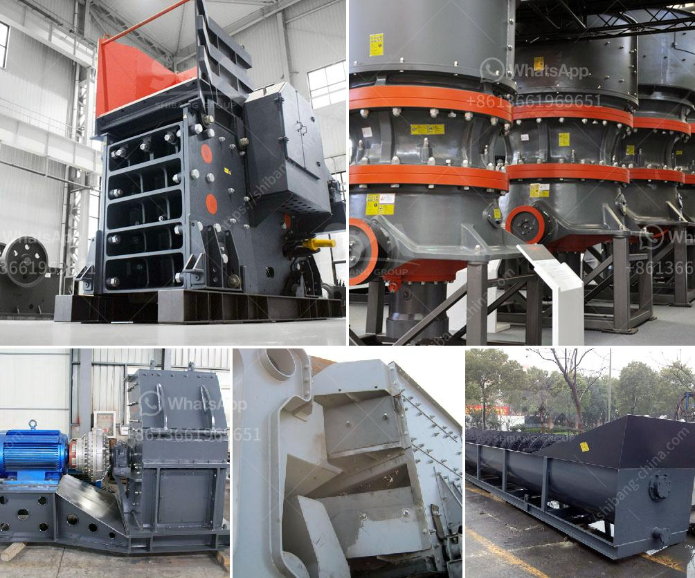

<h3>power calculation hammer mill equation</h3>
The power calculation hammer mill equation is an essential tool for estimating the power requirements of a hammer mill. The equation takes into account several factors such as the horsepower of the motor, the rotor speed, the size and type of hammers, and the desired particle size. This article will provide a detailed explanation of the power calculation hammer mill equation and its significance in the grinding process.

The first term of the equation represents the power required to rotate the rotor, while the second term represents the power required to break down the material into the desired particle size. The equation assumes that the hammers are evenly distributed around the rotor and that the grinding process is efficient.

The power calculation hammer mill equation has several practical applications in the field of grinding. It can be used to estimate the power requirements for a new hammer mill installation or to assess the performance of an existing mill. By adjusting the input parameters of the equation, such as the rotor speed or the size and type of hammers, one can optimize the grinding process for specific materials and desired particle sizes.

For example, suppose a manufacturer wants to grind wheat into flour using a hammer mill. The manufacturer knows the desired particle size of the flour, the type of hammers to be used, and the density of the wheat. By plugging in these values into the power calculation hammer mill equation, the manufacturer can estimate the power requirements for the mill. This information is crucial for selecting an appropriate motor size and ensuring efficient and cost-effective milling operations.

In conclusion, the power calculation hammer mill equation is a valuable tool for estimating the power requirements of a hammer mill. By considering various factors such as motor horsepower, rotor speed, hammer size and type, material density, and desired particle size, one can accurately estimate the power required for grinding operations. This information enables manufacturers to optimize the milling process, select suitable motor sizes, and achieve efficient and cost-effective grinding operations.
<h3>Contact us</h3><ul><li><strong>Whatsapp:&nbsp;<a href="https://wa.me/8613661969651">+8613661969651</a></strong></li><li><a href="https://swt.shibang-china.com/?git&amp;zhl&amp;power calculation hammer mill equation"><strong>Online Service(chat now)</strong></a></li></ul><h3>Related</h3><ul><li><a href='gold processing plant for sale.md'>gold processing plant for sale</a></li><li><a href='cost per ton quarry production.md'>cost per ton quarry production</a></li><li><a href='american cone crushers.md'>american cone crushers</a></li><li><a href='mini rock crushers for sale.md'>mini rock crushers for sale</a></li><li><a href='how to create a proposal for quarry factory.md'>how to create a proposal for quarry factory</a></li></ul>