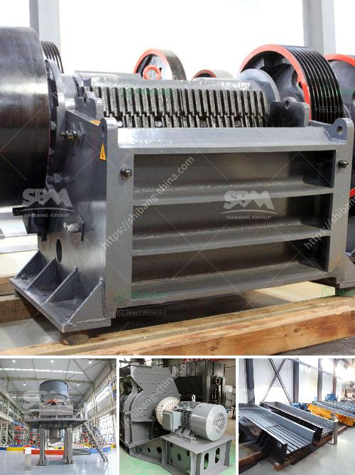

<h3>precipitated calcium carbonate plant</h3>
Calcium carbonate is a versatile compound used in various industries for numerous applications. Whether it's in the pharmaceutical, paint, or construction industry, calcium carbonate plays a crucial role in enhancing the properties of different materials. Traditionally, calcium carbonate is sourced from natural limestone deposits. However, the mining and processing of limestone can have a significant impact on the environment. That's where precipitated calcium carbonate (PCC) plants come into play.

A precipitated calcium carbonate plant offers a more sustainable and eco-friendly alternative to traditional limestone mining. By utilizing a chemical precipitation process, the PCC plant produces high-quality calcium carbonate with minimal environmental impact. This article explores the benefits of a precipitated calcium carbonate plant in manufacturing and its positive implications for the environment.

The process of producing PCC involves several steps. Firstly, limestone is pulverized into a fine powder, after which it is mixed with water and pumped into a reactor. Carbon dioxide is then introduced into the reactor, which reacts with the calcium carbonate in the limestone slurry to form calcium bicarbonate. This reaction causes calcium carbonate particles to precipitate out of the solution.

The precipitated calcium carbonate is then separated from the slurry, washed to remove impurities, and dried to obtain a fine powder. The PCC can be further processed to achieve specific particle sizes, surface modifications, and other properties required for various applications.

One of the key advantages of a precipitated calcium carbonate plant is that it utilizes waste carbon dioxide (CO2) emissions from industrial processes. The carbon dioxide generated during the reaction is taken from flue gases, which would otherwise be released into the atmosphere as greenhouse gases. By capturing and utilizing CO2, PCC plants contribute to reducing carbon emissions, making them a viable solution for achieving sustainable manufacturing practices.

In addition to being environmentally friendly, PCC offers numerous technical benefits that make it a preferred choice for various industries. Its fine particle size and narrow particle size distribution provide high levels of brightness and opacity, making it an ideal additive for paints, coatings, and paper production. PCC also improves the properties of plastics, rubber, and adhesives, enhancing their strength, durability, and flexibility.

Moreover, PCC acts as a filler in many applications, reducing the demand for virgin resources. By utilizing PCC, manufacturers can reduce the amount of primary raw material needed, leading to cost savings and conserving natural resources. The versatile nature of PCC allows manufacturers to achieve better material performance while simultaneously reducing their environmental footprint.

To conclude, the establishment of a precipitated calcium carbonate plant offers an innovative and sustainable solution for industries that require calcium carbonate. By utilizing waste carbon dioxide and minimizing the impact on natural resources, PCC plants significantly reduce environmental harm while offering versatile and high-quality products. As industries increasingly focus on sustainability, PCC plants are poised to play a critical role in ensuring a greener and more efficient manufacturing process.
<h3>Contact us</h3><ul><li><strong>Whatsapp:&nbsp;<a href="https://wa.me/8613661969651">+8613661969651</a></strong></li><li><a href="https://swt.shibang-china.com/?git&amp;zhl&amp;precipitated calcium carbonate plant"><strong>Online Service(chat now)</strong></a></li></ul><h3>Related</h3><ul><li><a href='rock crusher in dubai.md'>rock crusher in dubai</a></li><li><a href='sand washing machinery.md'>sand washing machinery</a></li><li><a href='quarry plant for sale.md'>quarry plant for sale</a></li><li><a href='suppliers of ball mill in bhopal.md'>suppliers of ball mill in bhopal</a></li><li><a href='process of mining silica rock crusher.md'>process of mining silica rock crusher</a></li></ul>