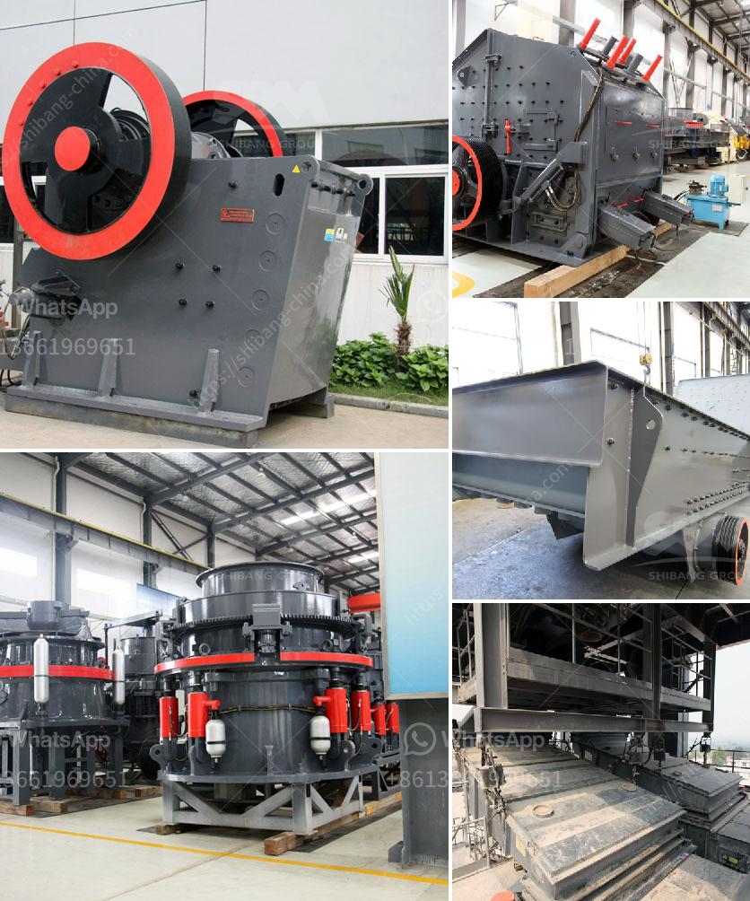

<h3>price 100 tph crusher plant</h3>
With the rapid development of infrastructure projects in various regions, the demand for aggregates of sand and gravel has increased significantly. To meet this demand, the construction industry requires durable and high-performance crushing equipment capable of processing large quantities of raw materials. One such solution is a 100 TPH crusher plant, which can provide aggregate up to 50mm for production of concrete, for road construction, etc.

Knowing the detailed price of a 100 TPH jaw crusher plant is very important for the customers. To understand the 100 TPH crusher plant price, we must first understand the technical parameters of the crusher, such as the type of crusher, its specifications, and the capacity of the crusher.

There are many types of crushers, including some star products like hydraulic cone crusher, fixed jaw crusher, rock jaw crusher, impact stone crusher, etc. In addition, Hongxing Machinery is known as sophisticated technology, best quality, and good reputation. Come on and you'll see that we have different types of crushing equipment.

The 100 TPH crusher plant consists of small mobile crushers known as crush and its transmission mode is mostly mechanical drive. Currently, the common used crushers include jaw crusher, impact crusher, cone crusher, hammer crusher, vertical shaft impact crusher and so on.

To obtain the price of a 100 TPH crusher plant, customers need to choose the appropriate configuration and equipment model. Depending on the different needs of customers, the price of the 100 TPH crusher plant will vary greatly. For example, the prices of 100 TPH jaw crushers are different from 100 TPH cone crushers. However, because of the advanced technology and excellent performance of our crushers, the prices are very reasonable.

A 100 TPH crusher plant not only requires proper planning for its installation but also requires accurate calculation of the investment cost, taking into account the market price and the feedback from customers. Although the price of a 100 TPH crusher plant may be higher than that of ordinary small-scale crushers, it provides more flexibility and convenience for industrial production. In conclusion, the comprehensive utilization of resources and cost-effective investment in a 100 TPH crusher plant will bring huge benefits to the project.

(Note: The price mentioned in the article is for reference purposes only and may vary depending on the location and supplier.)
<h3>Contact us</h3><ul><li><strong>Whatsapp:&nbsp;<a href="https://wa.me/8613661969651">+8613661969651</a></strong></li><li><a href="https://swt.shibang-china.com/?git&amp;zhl&amp;price 100 tph crusher plant"><strong>Online Service(chat now)</strong></a></li></ul><h3>Related</h3><ul><li><a href='crushing plants south africa.md'>crushing plants south africa</a></li><li><a href='stone crushers in bennta in bogota.md'>stone crushers in bennta in bogota</a></li><li><a href='iron processing machine.md'>iron processing machine</a></li><li><a href='talc grinding plant.md'>talc grinding plant</a></li><li><a href='philippines crusher equipment.md'>philippines crusher equipment</a></li></ul>