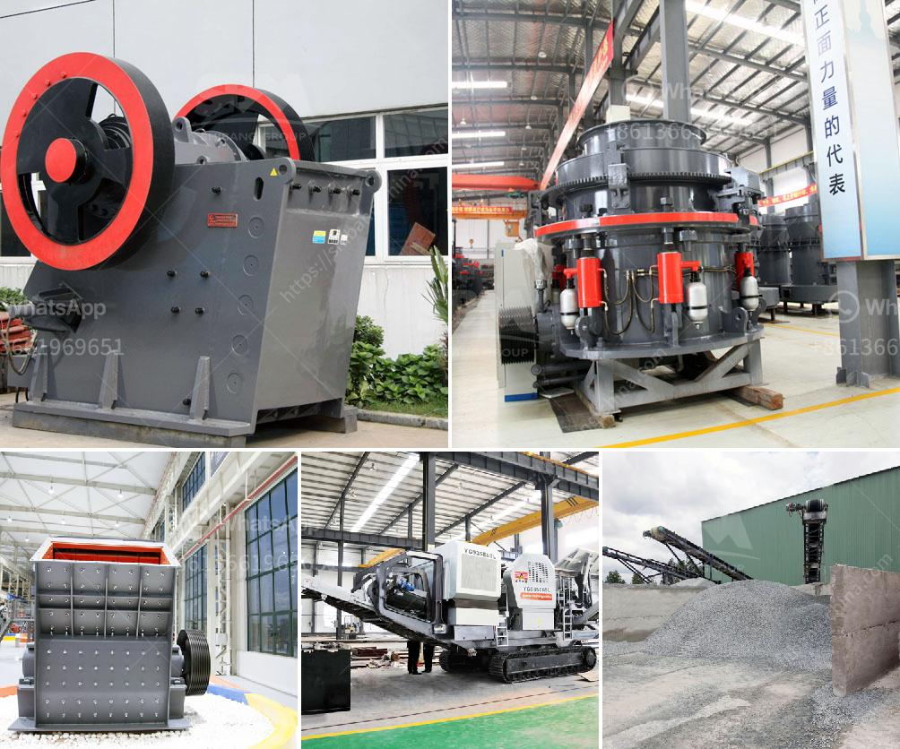

<h3>price and sales of quarry crusher in nigeria</h3>
Quarrying is a thriving industry in Nigeria, especially in the southern part of the country. According to the Nigerian Extractive Industries and Transparency Initiative (NEITI), the sector contributed about 0.85% to the nation's Gross Domestic Product (GDP) in 2019. Quarry crushers play a crucial role in this industry as they facilitate the processing of large rocks into smaller, more manageable sizes for construction and other purposes.

The price of quarry crushers in Nigeria varies greatly depending on the type, capacity, and location of the quarry. For instance, in Abakaliki, Ebonyi State, a small-scale quarry enterprise with a capacity of 120 tons per hour may cost around ₦15 million, while a larger one of 300 tons per hour capacity may cost as much as ₦60 million. These prices are however subject to negotiations and other factors such as equipment maintenance, location, and market demand.

The sales of quarry crushers in Nigeria have been on the rise since the country began experiencing a real estate boom. The demand for granite, gravel, and other quarry products used in construction has increased significantly, driving up the sales of quarry crushers. Additionally, the government's focus on infrastructure development through road construction, housing projects, and bridge construction has further boosted the sales of these crushers.

To cater to the growing demand, many local and international manufacturers have started investing in the Nigerian quarry crusher market. This has led to increased competition, which in turn has contributed to stabilizing prices and improving the quality of crushers available in the market.

In conclusion, the quarry crusher market in Nigeria is witnessing steady growth driven by increased construction activities and government infrastructure development initiatives. While prices may vary depending on several factors, the sales of these crushers are expected to remain strong in the coming years. As more manufacturers enter the market, customers can expect a wider variety of options to choose from, resulting in better quality crushers at competitive prices.
<h3>Contact us</h3><ul><li><strong>Whatsapp:&nbsp;<a href="https://wa.me/8613661969651">+8613661969651</a></strong></li><li><a href="https://swt.shibang-china.com/?git&amp;zhl&amp;price and sales of quarry crusher in nigeria"><strong>Online Service(chat now)</strong></a></li></ul><h3>Related</h3><ul><li><a href='how to build a small rock crusher.md'>how to build a small rock crusher</a></li><li><a href='rock stone crusher.md'>rock stone crusher</a></li><li><a href='mineral grinding mill unit.md'>mineral grinding mill unit</a></li><li><a href='spare parts dealer of crusher plant in odisha.md'>spare parts dealer of crusher plant in odisha</a></li><li><a href='ball mill operation and maintenance manual pdf.md'>ball mill operation and maintenance manual pdf</a></li></ul>