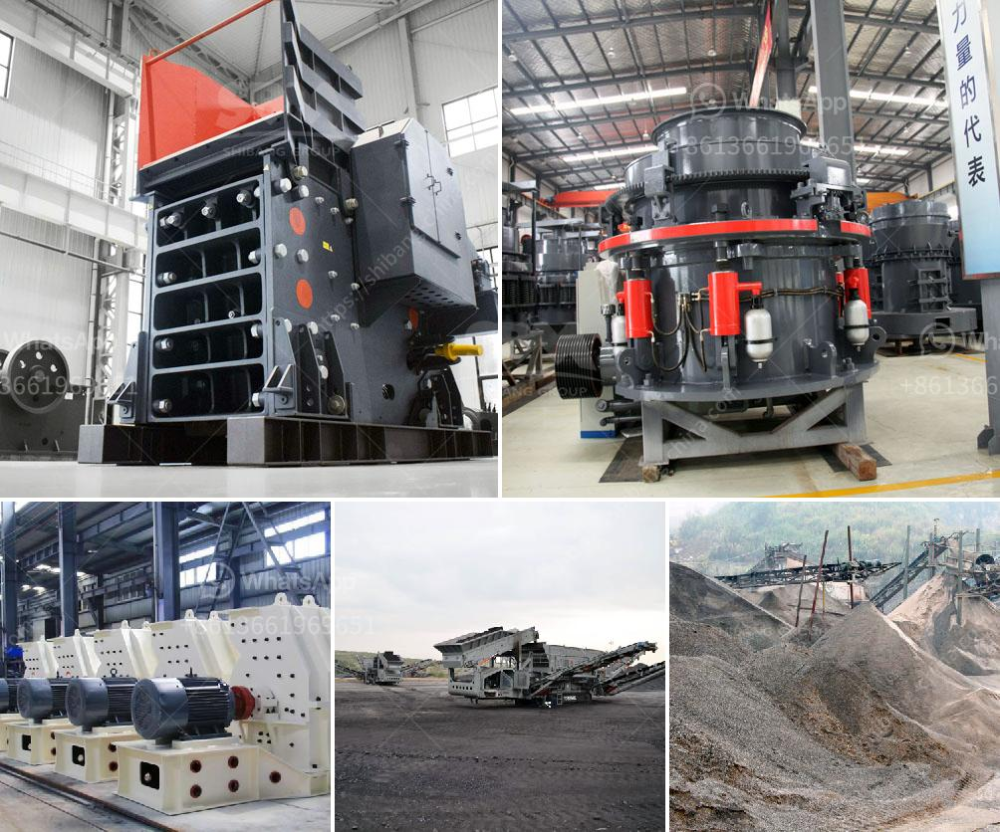

<h3>price conveyor belts</h3>
Conveyor belts are an essential component of many industries, providing a cost-effective and efficient means of moving materials from one location to another. Whether it's in factories, warehouses, or mining sites, conveyor belts play a crucial role in streamlining operations and maximizing productivity. However, when it comes to purchasing a conveyor belt, understanding the price range is of utmost importance to stay within budget constraints.

The pricing of conveyor belts can vary greatly depending on various factors such as material, length, and width. The type of material used for the belt, such as rubber, PVC, or steel, significantly influences its price. Rubber belts are usually more affordable compared to steel belts which are designed for heavy-duty applications.

The length and width of the conveyor belt also impact the cost. Longer and wider belts require more materials and may involve additional customization. Additionally, the weight and load capacity of the belt affect the price, as belts designed to carry heavier loads demand more robust construction and additional reinforcement.

Other cost-related factors include the complexity of the design, the inclusion of features like sidewalls or cleats, and the presence of additional accessories such as motorized drives or tracking systems. These factors can increase the price of a conveyor belt but may be necessary for specific applications or operational needs.

While the price range of conveyor belts can vary, it is essential to consider factors beyond just the initial cost. Reliability, durability, and lifespan are crucial considerations as a low-priced belt may need frequent repairs or replacements, leading to higher long-term costs. It is crucial to strike a balance between price and quality to ensure the optimal performance and longevity of the conveyor belt.

It is advisable to consult with reputable suppliers or conveyor system experts who can provide guidance on choosing the right conveyor belt within your budget constraints. By understanding the specific requirements of your industry or application, you can make an informed decision and invest wisely in a conveyor belt that offers value for money.

In conclusion, the price range of conveyor belts can vary depending on factors such as material, length, width, load capacity, and additional features. While it is important to consider the cost, it is equally important to prioritize reliability and durability to avoid frequent repairs or replacements in the long run. Consulting with professionals in the industry ensures you choose a conveyor belt that meets your needs while staying within your budget limits.
<h3>Contact us</h3><ul><li><strong>Whatsapp:&nbsp;<a href="https://wa.me/8613661969651">+8613661969651</a></strong></li><li><a href="https://swt.shibang-china.com/?git&amp;zhl&amp;price conveyor belts"><strong>Online Service(chat now)</strong></a></li></ul><h3>Related</h3><ul><li><a href='double rotor impact hammer crusher.md'>double rotor impact hammer crusher</a></li><li><a href='conventional stone crushers in peru.md'>conventional stone crushers in peru</a></li><li><a href='used crusher in tanzania.md'>used crusher in tanzania</a></li><li><a href='small portable rock crushers for sale africa.md'>small portable rock crushers for sale africa</a></li><li><a href='puzzolana 200 tph cone crusher plant price.md'>puzzolana 200 tph cone crusher plant price</a></li></ul>