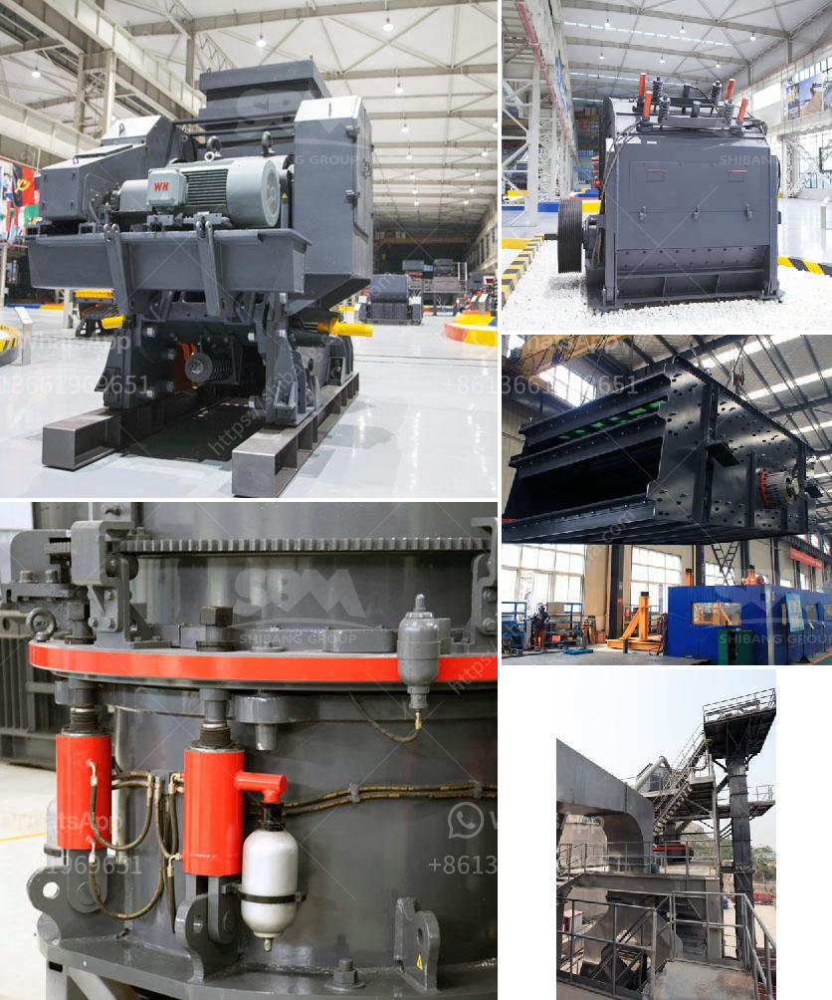

<h3>price for ball mills</h3>
Ball mills are essential equipment in various industries such as mining, construction, metallurgy, and pharmaceuticals. These mills are used to grind materials into smaller particles, resulting in a refined powder. When choosing a ball mill, the price is a crucial factor to consider. This article will explore the key factors that influence the price of ball mills and provide some tips for finding the best-priced mill for your needs.

One of the primary factors that determine the price of ball mills is their capacity. Ball mills are available in different sizes and capacities, ranging from laboratory scale mills with a few liters of volume to industrial mills with several meters of capacity. Generally, larger mills with higher capacities are priced higher due to the increased materials and construction required. It is important to assess your specific needs and choose a mill with an appropriate capacity to avoid spending more money than necessary.

The construction and material of a ball mill greatly affect its price. Mills made of heavy-duty materials such as stainless steel or hardened ceramics are usually more expensive but offer enhanced durability and longevity. On the other hand, mills made from standard steel or ordinary ceramics are more affordable but may not withstand heavy-duty usage. Consider the type of materials you plan to grind and the frequency of use to determine the most cost-effective option.

Ball mills can come with various features and accessories that affect their price. Some common features include digital controls for precise operation, automatic timers, grinding jars with different sizes and materials, and safety mechanisms. Advanced features such as programmable settings and variable speed control can further increase the price. Evaluate your specific requirements and budget to decide which features and accessories are essential and which ones you can do without.

The reputation and brand of the manufacturer can significantly impact the price of a ball mill. Well-established and reputable brands often charge a premium due to their proven track record of quality and performance. While it may be tempting to go for cheaper, lesser-known brands, it is important to balance price with reliability. Look for manufacturers with positive customer reviews and a history of delivering reliable products.

When considering the price of a ball mill, it is crucial to account for any additional costs that may arise. Some factors to consider include shipping and delivery fees, installation costs (especially for larger mills), and maintenance expenses. It may be worthwhile to inquire about warranty and after-sales service offerings, as these can save you money in the long run.

In conclusion, the price of ball mills is influenced by several factors such as capacity, material and construction, features, brand reputation, and additional costs. By carefully evaluating your specific needs and budget, you can make an informed decision when purchasing a ball mill. Remember to consider the long-term benefits, such as reliability and durability, in addition to the initial price. With thorough research and careful consideration, you will find a ball mill that offers the best value for your investment.
<h3>Contact us</h3><ul><li><strong>Whatsapp:&nbsp;<a href="https://wa.me/8613661969651">+8613661969651</a></strong></li><li><a href="https://swt.shibang-china.com/?git&amp;zhl&amp;price for ball mills"><strong>Online Service(chat now)</strong></a></li></ul><h3>Related</h3><ul><li><a href='ball mill for starch damage.md'>ball mill for starch damage</a></li><li><a href='production process of gypsum.md'>production process of gypsum</a></li><li><a href='marble paving making machinry price.md'>marble paving making machinry price</a></li><li><a href='stone crusher machine prices.md'>stone crusher machine prices</a></li><li><a href='jaw and cone crusher suppliers in mokopane.md'>jaw and cone crusher suppliers in mokopane</a></li></ul>