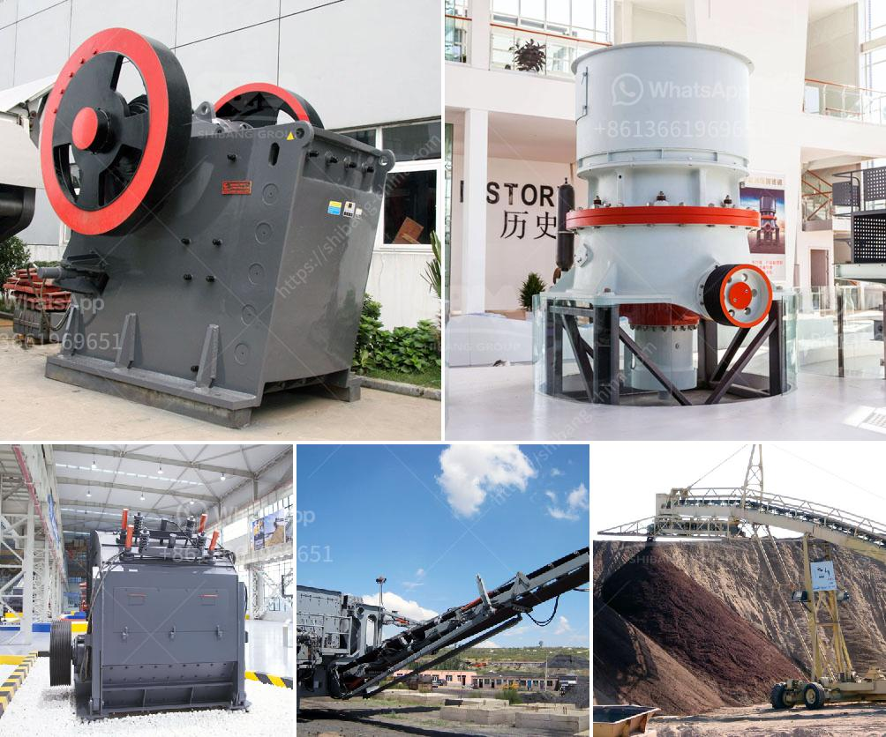

<h3>price list of used stone crushers in kenya</h3>
Stone crushing industry is an important industrial sector in the country. The crushed stone is then used as raw material for various construction activities i.e. construction of roads, bridges, buildings and canals. Over the last 10 years, the Construction sector has been registering strong growth rates in Kenya. This has prompted the need for importing used machinery which is typically available at lower cost than new ones.

When it comes to crushing equipment, used stone crushers are often preferred. The reason lies in their affordability and availability. In Kenya, stone crushing machines have different price lists. The price of stone crusher is determined by the crushed stone specifications required. Status of roads and other general infrastructure plays a crucial role in determining stone crusher prices.

There are various types and models of crushers to meet different requirements of customers. Below is a detailed price list of used stone crushers in Kenya.

Jaw crusher is the most common type of crusher used in Kenya. It utilizes two jaws to crush stones. This machine is usually used in mining, quarrying, road construction, metallurgical and other industries for crushing various ores and rocks of medium and fine hardness. The price of a jaw crusher ranges from Kshs 400,000 to Kshs 5,000,000 depending on the capacity, size, and brand.

Impact crushers are used to crush medium-hard rock and softer rock materials like limestone. These machines are oftentimes used to make fine materials or manufactured sand for construction purposes. The price of an impact crusher ranges from Kshs 2,000,000 to Kshs 5,500,000 depending on the capacity, size, and brand.

Cone crushers are primarily used for secondary or tertiary crushing of medium-hard materials such as granite, basalt, and iron ore. These machines are popular in industries like mining, road construction, and other engineering purposes. The price of a cone crusher ranges from Kshs 3,000,000 to Kshs 10,000,000 depending on the capacity, size, and brand.

Hammer crushers are used to crush materials with medium-hardness and low moisture content. These machines are often used in mining, cement manufacturing, and coal handling plants. The price of a hammer crusher ranges from Kshs 500,000 to Kshs 8,000,000 depending on the capacity, size, and brand.

It is important to note that the prices mentioned above are average estimates and can vary depending on various factors such as condition, location, and negotiation with the seller. Additionally, prices mentioned above exclude transportation and installation costs, which should be considered when purchasing used stone crushers.

In conclusion, the price list of used stone crushers in Kenya varies depending on the processing capacity, size, and brand. However, choosing a crusher that meets your needs and requirements is crucial. It is recommended to consult with professionals in the industry or experienced sellers to get the best value for your money.
<h3>Contact us</h3><ul><li><strong>Whatsapp:&nbsp;<a href="https://wa.me/8613661969651">+8613661969651</a></strong></li><li><a href="https://swt.shibang-china.com/?git&amp;zhl&amp;price list of used stone crushers in kenya"><strong>Online Service(chat now)</strong></a></li></ul><h3>Related</h3><ul><li><a href='mobile crusher in codelco.md'>mobile crusher in codelco</a></li><li><a href='roks vertical mill.md'>roks vertical mill</a></li><li><a href='mobile gold processing plants 1 ton per.md'>mobile gold processing plants 1 ton per</a></li><li><a href='lime stone crusher in south africa.md'>lime stone crusher in south africa</a></li><li><a href='dolomite powder mesh.md'>dolomite powder mesh</a></li></ul>