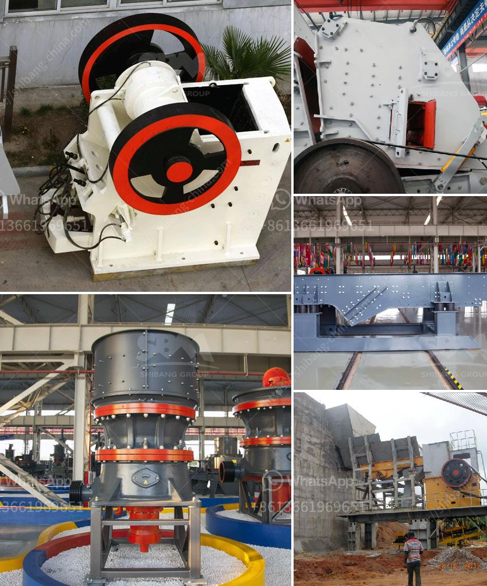

<h3>price mobile crusher</h3>
Mobile crushers have revolutionized the way construction and mining companies operate. These powerful machines are designed to reduce the size of large rocks and stones, bringing them to a manageable size for further processing. The mobile crusher market is growing at a rapid pace, as more and more companies are investing in this game-changing technology. However, one of the primary concerns for potential buyers is the price of a mobile crusher. In this article, we will explore the factors that affect the pricing of mobile crushers and their overall cost-effectiveness.

There are several factors that contribute to the pricing of mobile crushers. First and foremost, the type of crusher plays a significant role. There are primarily two types of crushers: jaw crushers and impact crushers. Jaw crushers are suitable for processing larger rocks and stones, while impact crushers are generally used for smaller rocks or sand production. The price of a jaw crusher is usually higher than the price of an impact crusher.

Another factor that affects the price of a mobile crusher is the technology used. Different crushers employ different technologies to achieve their crushing capabilities. Some crushers use hydraulic systems to provide a smoother and more efficient operation, while others rely on mechanical systems. The price of a crusher with advanced technology will typically be higher than one with simpler features.

The size and capacity of the mobile crusher also influence its price. Mobile crushers come in a variety of sizes and capacities, ranging from small models suitable for residential construction to large machines capable of handling tonnages of rock and stone. The larger the capacity of the crusher, the higher its price will be.

In addition to these factors, the brand and reputation of the manufacturer can also affect the price. Renowned manufacturers with a long-standing reputation for producing high-quality and reliable crushers often charge a premium for their products. However, it is important to note that these higher-priced crushers may offer better performance and durability, making them a more cost-effective choice in the long run.

When comparing the prices of different mobile crushers, it is crucial to take into consideration the overall cost-effectiveness of the machine. A lower-priced crusher may seem like a bargain initially, but it could end up costing more in terms of maintenance, repairs, and downtime. It is important to choose a crusher that offers a balance between price and performance, ensuring that it delivers both efficiency and reliability.

In conclusion, the price of a mobile crusher is influenced by various factors, including the type, technology, size, capacity, and brand. While it is essential to consider the price when purchasing a crusher, it is equally important to assess its overall cost-effectiveness. Investing in a high-quality crusher that offers efficiency, reliability, and durability can prove to be a wise decision in the long run, even if it comes with a higher price tag.
<h3>Contact us</h3><ul><li><strong>Whatsapp:&nbsp;<a href="https://wa.me/8613661969651">+8613661969651</a></strong></li><li><a href="https://swt.shibang-china.com/?git&amp;zhl&amp;price mobile crusher"><strong>Online Service(chat now)</strong></a></li></ul><h3>Related</h3><ul><li><a href='mobile fine jaw crusher at saudi arabia.md'>mobile fine jaw crusher at saudi arabia</a></li><li><a href='aggregate quarries crusher in thailand.md'>aggregate quarries crusher in thailand</a></li><li><a href='rumus tegangan pada belt conveyor.md'>rumus tegangan pada belt conveyor</a></li><li><a href='300 tons per hour mobile crawler crusher price.md'>300 tons per hour mobile crawler crusher price</a></li><li><a href='crush granite to powder.md'>crush granite to powder</a></li></ul>