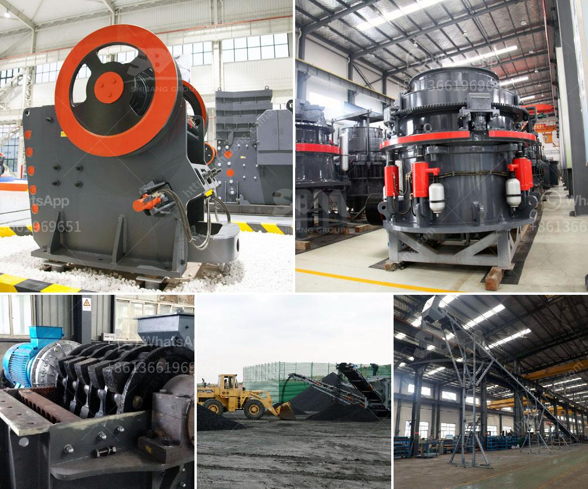

<h3>price of a large mobile crusher</h3>
The development of technology has brought the advent of large mobile crushers. With an incredible capacity range of hundreds of tons per hour, they are being used in various industries like mining, quarrying, recycling, demolition, and contracting. Large mobile crushers have become a popular choice for numerous businesses due to their ability to crush materials into precise sizes and the convenience they offer in terms of mobility.

One of the essential factors while considering the purchase of a large mobile crusher is the price. Depending on the capacity, configuration, and additional features, the cost of a large mobile crusher can range from hundreds of thousands to millions of dollars. It is crucial for businesses to understand the factors that influence the price and make an informed decision.

First and foremost, the capacity of the crusher plays a significant role in determining its price. Higher capacity crushers can handle more significant volumes of material and are generally more expensive. The size and weight of the crusher also affect its price, as larger crushers require more powerful engines and heavier construction materials. Additionally, larger crushers might need additional components and accessories, increasing the overall cost.

The technology and features included in the mobile crusher can also impact the price. Crushers with advanced automation systems, improved control systems, and better safety features tend to be pricier. These technological advancements not only ensure higher productivity and efficiency but also enhance the safety and convenience of operating the crusher.

Another critical factor that affects the pricing of large mobile crushers is the quality and durability of the materials used in their construction. Crushers made from high-quality materials tend to be more expensive initially but offer better long-term reliability. Investing in a robust and durable crusher may result in cost savings over time, as it will have lower maintenance and repair requirements.

The brand and reputation of the manufacturer can also influence the price. Well-established brands with a proven track record might charge a premium for their crushers due to their reputation for quality and reliability. However, it is essential to consider customer reviews, testimonials, and overall market reputation before making a decision based solely on the brand.

Lastly, additional features like mobility options and customization can further impact the price of a large mobile crusher. Mobile crushers with the ability to move from one site to another are generally more expensive compared to stationary crushers. Customization options, such as specialized crushing chambers or specific configurations for certain materials, can also increase the overall cost.

In conclusion, the price of a large mobile crusher can vary significantly depending on various factors. The capacity, technology, material quality, brand reputation, and additional features all play a role in determining the final cost. It is crucial for businesses to carefully evaluate their requirements, budget, and expected return on investment to make an informed decision when purchasing a large mobile crusher.
<h3>Contact us</h3><ul><li><strong>Whatsapp:&nbsp;<a href="https://wa.me/8613661969651">+8613661969651</a></strong></li><li><a href="https://swt.shibang-china.com/?git&amp;zhl&amp;price of a large mobile crusher"><strong>Online Service(chat now)</strong></a></li></ul><h3>Related</h3><ul><li><a href='vibration screen machine in pakistan.md'>vibration screen machine in pakistan</a></li><li><a href='feldspar ball mill in kenya.md'>feldspar ball mill in kenya</a></li><li><a href='barite grinding equipment.md'>barite grinding equipment</a></li><li><a href='rock crusher machine price in india.md'>rock crusher machine price in india</a></li><li><a href='renting of screens and crushers.md'>renting of screens and crushers</a></li></ul>