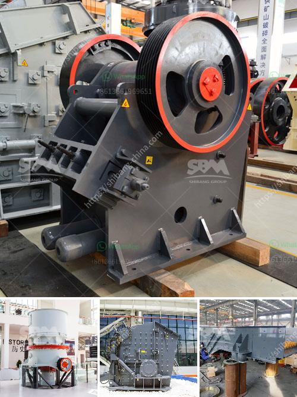

<h3>price of ball mill</h3>
Ball mill is mainly used to grind materials in mineral, cement, refractory, chemical industry, etc. When you use the ball mill, the following factors should be taken into consideration.

Firstly, the price of the ball mill is in line with the practical production demand. Among the different types and models of the ball mill, the price varies from a few thousand to hundreds of thousands dollars for large models with an annual output of more than 100,000 tons. Therefore, it is important to choose the right ball mill price according to the production needs.

Secondly, the quality of the ball mill directly affects its price. The high-quality equipment will bring high production efficiency, low energy consumption, and long-term benefits. Conversely, the low-quality equipment often has higher maintenance costs and lower productivity, which will inevitably affect the overall production efficiency. Therefore, when purchasing a ball mill, it is essential to consider the quality of the equipment.

Thirdly, the after-sales service and maintenance of the ball mill are also important factors in determining its price. Good after-sales service can effectively solve various problems encountered in the operation of the ball mill, ensuring the smooth progress of production. In addition, regular maintenance can extend the service life of the equipment and reduce unnecessary losses.

Moreover, the price of the ball mill is closely related to the manufacturer and brand. Different manufacturers have different production technologies, equipment materials, and processing capabilities, which will lead to differences in product quality and price. Well-known brands usually have better performance, higher stability, and more comprehensive after-sales service. Although the price may be relatively higher, the overall cost-effectiveness is higher.

In addition, the price of the ball mill will also be affected by factors such as the size of the production line, production capacity, and the degree of automation. For example, larger production lines generally require more advanced equipment and technologies, resulting in higher prices. Similarly, higher production capacity and higher degree of automation also mean higher prices.

In summary, the price of the ball mill is determined by various factors, including the practical production demand, the quality of the equipment, the after-sales service, the manufacturer and brand, and the size of the production line. By carefully considering these factors, you can find a ball mill that meets your production needs and offers a good price-performance ratio. Investing in a high-quality and reliable ball mill can bring long-term benefits and contribute to the success of your production line.
<h3>Contact us</h3><ul><li><strong>Whatsapp:&nbsp;<a href="https://wa.me/8613661969651">+8613661969651</a></strong></li><li><a href="https://swt.shibang-china.com/?git&amp;zhl&amp;price of ball mill"><strong>Online Service(chat now)</strong></a></li></ul><h3>Related</h3><ul><li><a href='stone crusher for gold mining in south africa.md'>stone crusher for gold mining in south africa</a></li><li><a href='enquiry about crusher.md'>enquiry about crusher</a></li><li><a href='conventional stone crushers in peru.md'>conventional stone crushers in peru</a></li><li><a href='coal washing plant drawing.md'>coal washing plant drawing</a></li><li><a href='complete crushing plant 150 200t.md'>complete crushing plant 150 200t</a></li></ul>