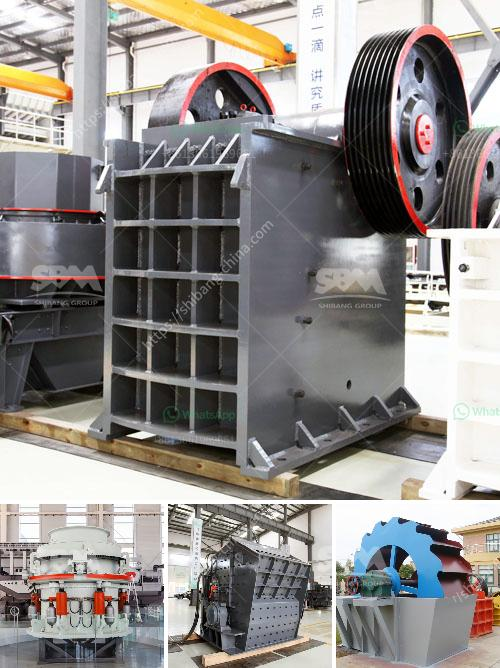

<h3>price of conveyor belts for soaps</h3>
Conveyor belts play a crucial role in the manufacturing of soaps, providing a seamless and efficient process of moving products along the production line. When it comes to selecting conveyor belts for soap production, the price is a significant factor to consider.

The price of conveyor belts for soaps can vary depending on various factors, including the type of material used, the design, and the length and width required for the production line. Typically, conveyor belts for soap production are made from durable materials like stainless steel or food-grade plastic. These materials ensure cleanliness, durability, and resistance to chemical reactions caused by soap ingredients.

The price range for conveyor belts used in soap production generally starts at around $500 and can go up to several thousand dollars. The cost increases as the size and complexity of the conveyor belt system increase. A larger and more intricate production line might require additional components like support frames, motors, and control panels, increasing the overall cost.

It is also essential to consider the maintenance and lifespan of the conveyor belts. Cheaper conveyor belts may have a shorter lifespan and require more frequent repair or replacement. On the other hand, investing in a higher-quality conveyor belt can result in lower maintenance costs in the long run.

Moreover, reputable manufacturers or suppliers offer different pricing options and after-sales support. Some may offer discounted rates for bulk orders or provide warranties that cover maintenance and repairs. It is essential to do thorough research, compare prices, and consider the reputation and customer reviews of the manufacturer or supplier before making a decision.

In conclusion, the price of conveyor belts for soap production can vary depending on factors such as material, design, and size. It is crucial to strike a balance between cost and quality, ensuring the conveyor belt meets the specific needs of the soap manufacturing process. Taking into account maintenance, lifespan, and after-sales support can help make an informed decision on the best conveyor belt choice for soap production.
<h3>Contact us</h3><ul><li><strong>Whatsapp:&nbsp;<a href="https://wa.me/8613661969651">+8613661969651</a></strong></li><li><a href="https://swt.shibang-china.com/?git&amp;zhl&amp;price of conveyor belts for soaps"><strong>Online Service(chat now)</strong></a></li></ul><h3>Related</h3><ul><li><a href='mobile fine jaw crusher at saudi arabia.md'>mobile fine jaw crusher at saudi arabia</a></li><li><a href='aggregate crusher supplier.md'>aggregate crusher supplier</a></li><li><a href='process of mining silica rock crusher.md'>process of mining silica rock crusher</a></li><li><a href='crushing asphalt with jaw crusher.md'>crushing asphalt with jaw crusher</a></li><li><a href='stone crusher second.md'>stone crusher second</a></li></ul>