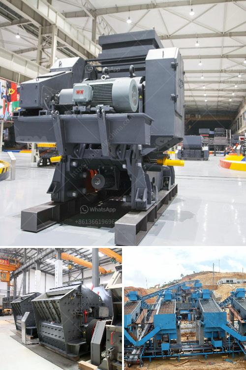

<h3>price of crushed stone in ethiopia</h3>
Ethiopia, a landlocked country in the Horn of Africa, is known for its diverse landscapes and rich cultural heritage. It is also home to a growing construction industry with a high demand for construction materials such as crushed stone.

Due to the booming infrastructure sector, the demand for crushed stone is constantly on the rise. With the increasing need for housing and infrastructure projects, the pressure on natural resources is becoming alarming. By understanding the factors that influence the price of crushed stone, it can help you make informed decisions when purchasing the material.

One of the most important factors is availability. This is influenced by the accessibility of the stone deposits and the transportation infrastructure. In Ethiopia, stone mining is a traditional industry that has been prevalent for centuries. The country is home to some of the world’s oldest stone structures, such as the rock-hewn churches in Lalibela and the obelisks in Axum.

However, the availability of these resources is limited in some areas due to various factors such as geographical constraints, land ownership disputes, and environmental regulations. As a result, the cost of transportation to bring crushed stone from distant locations can significantly increase its price.

Quality is another factor that determines the price of crushed stone. The more durable and high-quality the stone, the higher its value. In Ethiopia, the quality of the crushed stones is directly proportional to the amount of fines and impurities in the stones.

The higher the fines content, the lower the quality. There are several types of crushed rock that can be used for various construction purposes, such as ¾ inch clean crushed stone, ½ inch clean crushed stone, and ¼ inch clean crushed stone. The type of project you are undertaking will determine the crushed stone variety you require.

The price of crushed stone can also vary depending on local market factors and fluctuating fuel prices. In terms of delivery, wholesale pricing can be more affordable than buying in smaller quantities and having it delivered to your doorstep. However, keep in mind that bulk purchases may require additional storage space and careful planning to avoid waste.

To get the best price for crushed stone, it is always a good idea to shop around and compare prices from different suppliers. Look for suppliers who have a good reputation and can provide consistent quality and service. Consult with experts in the construction industry for recommendations and advice on the best suppliers in your area.

In conclusion, the price of crushed stone in Ethiopia is influenced by several factors, including availability, quality, transportation, and market dynamics. Understanding these factors and their impact on price can help you make an informed decision when purchasing crushed stone for your construction project. With the right knowledge, you can ensure that you are getting the best value for your money while also supporting sustainable and ethical sourcing practices.
<h3>Contact us</h3><ul><li><strong>Whatsapp:&nbsp;<a href="https://wa.me/8613661969651">+8613661969651</a></strong></li><li><a href="https://swt.shibang-china.com/?git&amp;zhl&amp;price of crushed stone in ethiopia"><strong>Online Service(chat now)</strong></a></li></ul><h3>Related</h3><ul><li><a href='river sand washed machine.md'>river sand washed machine</a></li><li><a href='stone crusher buatan indonesia.md'>stone crusher buatan indonesia</a></li><li><a href='cost of 100 tpd cement plant.md'>cost of 100 tpd cement plant</a></li><li><a href='silica powder making machinery in haiti.md'>silica powder making machinery in haiti</a></li><li><a href='250tph capacity of stone crusher.md'>250tph capacity of stone crusher</a></li></ul>