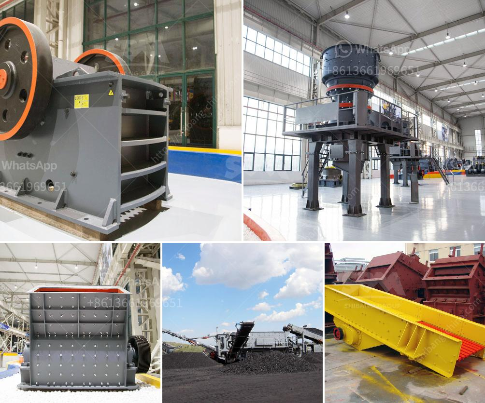

<h3>price of crusher machine</h3>
Crusher machines, also known as stone crushers, are essential pieces of equipment in the mining and construction industries. Reliable and robust, they break down larger rocks into smaller, more manageable sizes, making it easier to process materials for subsequent extraction or utilization. However, the price of these machines can vary significantly based on various factors.

One significant factor that influences the price of a crusher machine is its brand reputation and popularity. Established and well-known brands often charge a premium for their products due to their proven track record and reliability. Customers are willing to pay more for a machine that comes from a trusted manufacturer with a solid reputation for quality and durability.

Additionally, these brands invest heavily in research and development to continually improve their products, ensuring that customers receive the latest advancements in crushing technology. As a result, they tend to charge higher prices to recoup their research and development costs.

Another factor that affects the price of crusher machines is the type of machine you're looking to purchase. Different machines have varying capabilities, sizes, and functionalities, and these differences are reflected in their prices. For instance, a smaller, portable crusher machine may be more affordable than a larger, stationary one since it requires fewer materials and has a less complex construction.

Moreover, the location where you intend to purchase the machine also impacts its price. Prices may vary from one region to another, depending on factors such as local taxes, import costs, and transportation expenses. Therefore, it is essential to consider the location when comparing prices and budgeting for a crusher machine.

While the brand, type, and location play a crucial role in determining the price, it is also essential to consider the specific features and specifications you require. Some machines may come with additional features to enhance efficiency or ease of use. These features can influence the price, often making the machine more expensive. However, if these features contribute significantly to your operational needs, it may be worth investing in a higher-priced machine.

Furthermore, the price of a crusher machine can also be influenced by market demand and competition. If there are several manufacturers producing similar machines, the prices may be relatively lower due to competition. On the other hand, if a specific brand or type of crusher machine dominates the market, it may enjoy a monopoly, allowing them to set higher prices.

With all these factors in mind, it is crucial to consider your specific requirements, budget, and long-term needs when purchasing a crusher machine. While it might be tempting to opt for the cheapest option available, it is essential to evaluate the machine's quality, reliability, and performance to ensure it meets your requirements and provides a reasonable return on investment.

In conclusion, the price of a crusher machine can vary significantly based on factors such as brand reputation, type of machine, location, specific features, and market conditions. While it is tempting to focus solely on price, it is equally important to consider the machine's quality, durability, and suitability for your needs. By weighing these factors carefully, you can make an informed decision and choose the crusher machine that best fits your requirements and budget.
<h3>Contact us</h3><ul><li><strong>Whatsapp:&nbsp;<a href="https://wa.me/8613661969651">+8613661969651</a></strong></li><li><a href="https://swt.shibang-china.com/?git&amp;zhl&amp;price of crusher machine"><strong>Online Service(chat now)</strong></a></li></ul><h3>Related</h3><ul><li><a href='hard rock quarry crusher in libya.md'>hard rock quarry crusher in libya</a></li><li><a href='hydraulic cone crusher.md'>hydraulic cone crusher</a></li><li><a href='used mobile jaw crusher for sale uk.md'>used mobile jaw crusher for sale uk</a></li><li><a href='coal crusher equipment.md'>coal crusher equipment</a></li><li><a href='how to grind stone into fine powder.md'>how to grind stone into fine powder</a></li></ul>