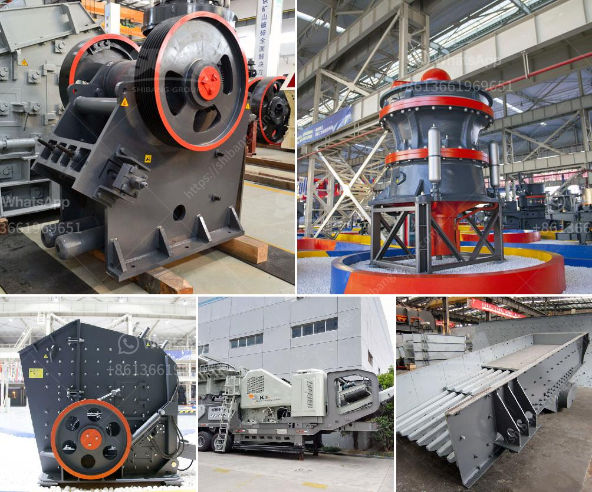

<h3>price of crusher of stone in peru</h3>
Stone crushing is a crucial industry in Peru, as it contributes significantly to the construction sector. Peru is experiencing an ongoing boom in construction activities, which is stimulating the demand for crushers. Due to the diverse geological features and rich mineral resources in Peru, efficient crushing equipment has become an essential requirement. However, understanding the dynamics of the market and the price of crusher of stone in Peru can be a challenging task. Let's delve deeper into this subject.

Several factors influence the pricing of stone crushers in Peru. Firstly, the quality and performance of the equipment play a vital role. High-quality crushers tend to have higher prices due to their durability and reliability. Customers prefer such crushers as they require less maintenance and deliver optimal crushing results.

Additionally, the size and capacity of the crusher also affect its price. Crushers with higher capacities and larger feeding sizes usually come with higher price tags. This is because they tend to offer higher production rates and can handle larger rocks, making them suitable for large-scale construction projects.

Moreover, labor and energy costs also contribute to the overall pricing. In Peru, labor costs are relatively lower compared to developed countries, which helps manufacturers keep the prices competitive. However, energy costs can fluctuate due to market conditions and can impact the final price of the crushers. The availability of skilled labor and raw materials also influences the overall pricing.

The stone crusher market in Peru is highly competitive, with numerous manufacturers offering a wide range of products. The competitive landscape often drives companies to offer competitive prices and attractive deals to attract customers. Therefore, customers have the advantage of exploring various options and comparing prices before making their purchase.

In Peru, the price range for a stone crusher typically varies between $50,000 to $200,000 USD. This range includes crushers with different specifications and capabilities. The prices vary based on factors such as brand reputation, additional features, and manufacturing quality.

When buying a stone crusher in Peru, customers must consider several factors apart from price. It is essential to choose a reputable manufacturer with a proven track record in producing high-quality crushers. Additionally, considering after-sales service and technical support is crucial to ensure smooth operations and timely maintenance of the equipment.

Looking ahead, the demand for stone crushers in Peru is expected to remain high due to ongoing construction projects and infrastructure development. The government's focus on building highways, bridges, and residential complexes will continue to drive the demand for crushers. This sustained demand is likely to contribute to market stability, ensuring a vibrant and competitive environment.

In conclusion, understanding the pricing dynamics of stone crushers in Peru requires considering factors such as quality, capacity, labor, and energy costs. The market competition drives manufacturers to offer competitive prices, providing customers with a wide range of options. As the construction sector in Peru continues to grow, the demand for stone crushers is expected to rise, ensuring a promising future for the industry.
<h3>Contact us</h3><ul><li><strong>Whatsapp:&nbsp;<a href="https://wa.me/8613661969651">+8613661969651</a></strong></li><li><a href="https://swt.shibang-china.com/?git&amp;zhl&amp;price of crusher of stone in peru"><strong>Online Service(chat now)</strong></a></li></ul><h3>Related</h3><ul><li><a href='puzzolana 200 tph cone crusher plant price.md'>puzzolana 200 tph cone crusher plant price</a></li><li><a href='quarry machines and prices.md'>quarry machines and prices</a></li><li><a href='price list of used stone crushers in kenya.md'>price list of used stone crushers in kenya</a></li><li><a href='hammer crusher hammer balancing chart.md'>hammer crusher hammer balancing chart</a></li><li><a href='hard rock crushers manufacturers india.md'>hard rock crushers manufacturers india</a></li></ul>