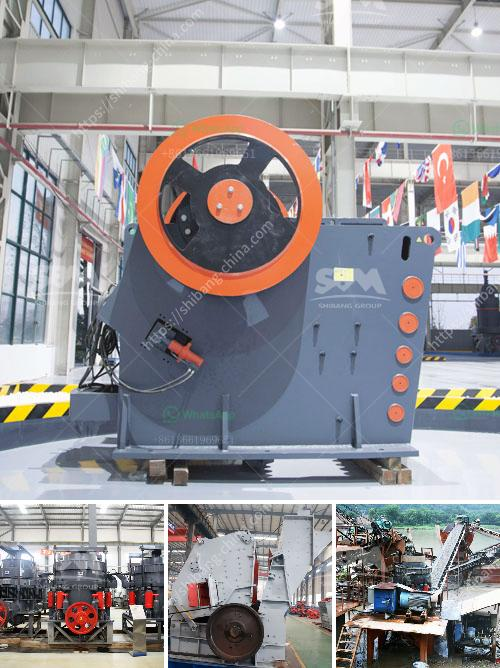

<h3>price of crushing machine</h3>
When it comes to purchasing crushing machines, there are numerous factors that one must consider. With the wide range of options available in the market, it is crucial to take into account the price of the machine. The price of a crushing machine can vary greatly, depending on the features, capacity, brand, and functionality. In this article, we will discuss the key factors that influence the price range of crushing machines.

First and foremost, the capacity of the machine plays a significant role in determining its price. Crushing machines with higher capacities tend to be more expensive as they can process larger volumes of material. It is essential to consider the amount of material you need to crush regularly and choose a machine accordingly.

The brand of the crushing machine also affects its price. Renowned brands that have established themselves in the industry tend to charge higher prices due to their reputation and quality assurance. However, it is important to note that lesser-known brands may offer similar features and functionalities at a lower price.

The type of crushing machine is another crucial factor. There are various types of crushers available, such as jaw crushers, cone crushers, and impact crushers, each with its own price range. The specific application and desired output of the crushed material will help determine the type of crushing machine to invest in.

Additional features and technology incorporated into the machine can also drive up the price. Advanced features like automation, remote control operation, and high-speed crushing capabilities can significantly increase the overall cost. It is important to evaluate your requirements and assess whether these additional features are necessary for your operations.

Furthermore, the availability of spare parts and after-sales services should also be considered. Machines may require regular maintenance, repair, or replacement of certain parts. Ensuring the availability of spare parts and reliable after-sales services can save you both time and money in the long run.

In conclusion, the price range of crushing machines can vary depending on various factors. It is essential to carefully assess your requirements, consider the capacity, brand, type, additional features, and after-sales services before making a purchase. By doing so, you can ensure that you invest in a crushing machine that meets your specific needs and provides optimal value for your money.
<h3>Contact us</h3><ul><li><strong>Whatsapp:&nbsp;<a href="https://wa.me/8613661969651">+8613661969651</a></strong></li><li><a href="https://swt.shibang-china.com/?git&amp;zhl&amp;price of crushing machine"><strong>Online Service(chat now)</strong></a></li></ul><h3>Related</h3><ul><li><a href='fine powder grinding machine.md'>fine powder grinding machine</a></li><li><a href='automatic terrazzo pressing machine.md'>automatic terrazzo pressing machine</a></li><li><a href='aggregate quarries crusher in thailand.md'>aggregate quarries crusher in thailand</a></li><li><a href='vertical mill price.md'>vertical mill price</a></li><li><a href='how much complete cost for iron ore crasher plants setup.md'>how much complete cost for iron ore crasher plants setup</a></li></ul>