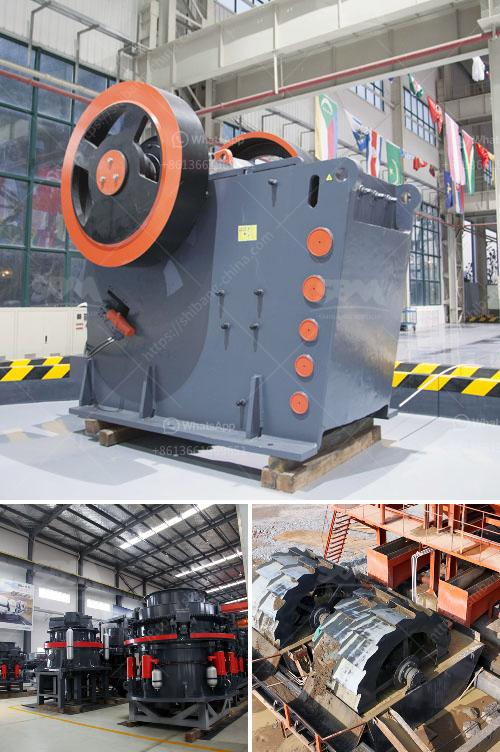

<h3>price of diamond mining construction</h3>
Diamond mining is a capital-intensive industry fraught with numerous challenges, and the construction of diamond mines is no exception. The process of developing a diamond mine involves a hefty investment of time, resources, and expertise. From securing permits to building infrastructure, the price of diamond mining construction can range from millions to billions of dollars. In this article, we delve into the factors that contribute to the high costs associated with diamond mining construction.

One of the primary factors influencing the price of diamond mining construction is the remote and often inhospitable locations where diamond deposits are found. Many diamond mines are situated in rural or isolated areas, which lack the necessary infrastructure for large-scale mining operations. Consequently, diamond mining companies must invest heavily in the construction of roads, power lines, and water management systems to support their operations. The cost of building such infrastructure in these remote regions can be exorbitant due to the need for specialized equipment and the challenges posed by rugged terrains.

Moreover, diamond mining requires intensive geological studies to identify potential diamond-rich areas. This involves conducting extensive surveys and test drilling to ascertain the presence of economically viable diamond deposits. These geological studies alone can cost millions of dollars, and additional expenses may be incurred if further exploration is required to pinpoint the exact locations of diamond concentrations. Delving into the intricate geology of diamond deposits demands the expertise of geologists, mining engineers, and other specialists, increasing the overall cost of the project.

Another cost driver is the environmental impact assessment (EIA) that diamond mining companies must undertake before commencing operations. The EIA ensures that sustainable and responsible practices are followed to preserve the local ecosystem. Conducting comprehensive studies on the potential environmental impact and developing strategies to mitigate these impacts requires a considerable investment of time, resources, and expertise. Diamond mining construction often includes measures such as water recycling systems and land rehabilitation programs, further adding to the overall costs.

The very nature of diamond deposits poses a unique challenge: they are finite and often concentrated in very specific areas. This means that diamond mining companies have to access and extract the diamonds within a limited time frame. Consequently, the high-pressure scenario of time constraints necessitates the deployment of large-scale mining equipment, such as earth movers, crushers, and screening plants. Acquiring, operating, and maintaining this heavy machinery can significantly escalate the cost of diamond mining construction.

In addition to these factors, labor costs, local regulations, and security measures are also significant contributors to the overall price of diamond mining construction. Operating in remote areas requires attracting and retaining skilled labor, which often comes at a premium. Compliance with local regulations and legal procedures can further escalate costs, and the need for tight security to protect valuable diamond reserves and deter illegal activities adds yet another layer of expenditure.

In conclusion, the construction of diamond mines comes with a steep price tag due to various factors. The remote locations, geological studies, environmental assessments, time constraints, heavy machinery, labor costs, regulations, and security measures all contribute to the overall cost. Diamond mining companies must carefully consider these factors and develop comprehensive financial plans to ensure the economic viability of their ventures. Despite the challenges, the allure of precious diamonds continues to drive investments into this industry, making diamond mining construction a costly yet potentially lucrative endeavor.
<h3>Contact us</h3><ul><li><strong>Whatsapp:&nbsp;<a href="https://wa.me/8613661969651">+8613661969651</a></strong></li><li><a href="https://swt.shibang-china.com/?git&amp;zhl&amp;price of diamond mining construction"><strong>Online Service(chat now)</strong></a></li></ul><h3>Related</h3><ul><li><a href='stone crushing machine price in india.md'>stone crushing machine price in india</a></li><li><a href='coal washing plant in pakistan.md'>coal washing plant in pakistan</a></li><li><a href='gypsum crushing machines.md'>gypsum crushing machines</a></li><li><a href='used stone crusher machine for sale in uae.md'>used stone crusher machine for sale in uae</a></li><li><a href='puzzolana 200 tph cone crusher plant price.md'>puzzolana 200 tph cone crusher plant price</a></li></ul>