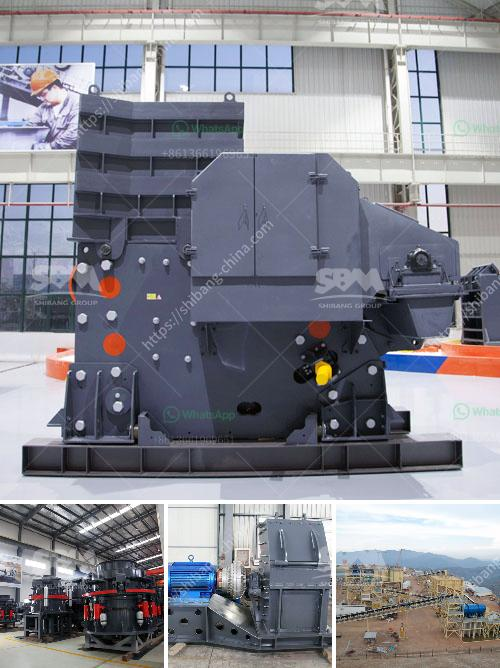

<h3>price of jaw crusher</h3>
The price of a jaw crusher generally ranges from tens of thousands to hundreds of thousands of dollars, the specific price will be affected by factors such as the region where the supplier is located, the manufacturer of the equipment, the transportation costs and other factors. When considering the purchase of a jaw crusher, it is essential to compare the prices and quality of the equipment. 

The price of the jaw crusher is mainly affected by the material of the equipment itself and the manufacturing process. Factors such as material hardness, storage capacity, size, shape, and the amount of feeding and discharging have a direct impact on the price of the jaw crusher. So before purchasing a jaw crusher, it's crucial to also consider these factors.

Another vital factor that affects the price of the jaw crusher is the market demand for equipment. Equipment with high market demand will attract more suppliers, and the competition among suppliers will naturally increase. In order to gain an advantage in the market, suppliers will reduce their prices to attract more customers. On the other hand, if the market demand is relatively low, the price of the equipment may be relatively higher due to limited supply. 

The quality of the jaw crusher also determines its price. A high-quality jaw crusher not only has a long service life but also requires less maintenance, reducing the production cost for the customer. Therefore, when purchasing a jaw crusher, it is necessary to check whether the equipment has passed the ISO9001 certification and whether it meets the national quality standards. It is also recommended to visit the manufacturer in person to examine the production process and get a better understanding of the quality control measures taken by the manufacturer.

Transportation costs are another important factor that affects the price of jaw crushers. Generally, jaw crushers are heavy equipment and require transportation from the manufacturer to the customer's site. The farther the transportation distance, the higher the transportation cost. Therefore, choosing a local supplier or a supplier with a distribution network closer to the customer's location can effectively reduce transportation costs.

In conclusion, when buying a jaw crusher, customers should not only focus on the price but also consider the quality, market demand, and transportation costs. Comparing prices from different suppliers and making a comprehensive assessment will help customers make a wise purchase decision. Remember, a cheaper price does not always mean better value, as a high-quality jaw crusher will bring more benefits in the long run.
<h3>Contact us</h3><ul><li><strong>Whatsapp:&nbsp;<a href="https://wa.me/8613661969651">+8613661969651</a></strong></li><li><a href="https://swt.shibang-china.com/?git&amp;zhl&amp;price of jaw crusher"><strong>Online Service(chat now)</strong></a></li></ul><h3>Related</h3><ul><li><a href='price list of used stone crushers in kenya.md'>price list of used stone crushers in kenya</a></li><li><a href='calcite mining plant.md'>calcite mining plant</a></li><li><a href='bentonite grinding mill.md'>bentonite grinding mill</a></li><li><a href='cornerstone equipment used rock crushers.md'>cornerstone equipment used rock crushers</a></li><li><a href='slag grinding ball mill.md'>slag grinding ball mill</a></li></ul>