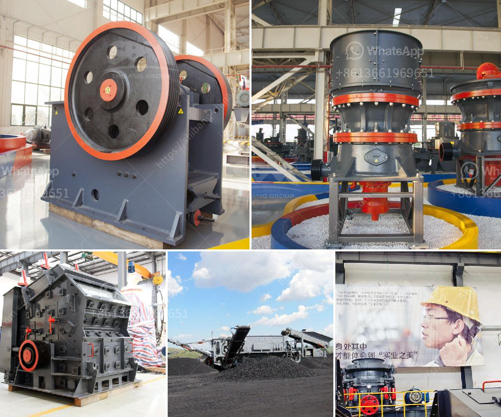

<h3>price of mobile crusher</h3>
Mobile crushers are essential for the crushing of various materials during construction projects. With increased demand for these crushers, the manufacturers are coming up with new variants to cater to the growing needs of customers. It is important to note that the price of mobile crusher is influenced by various factors, including model, brand, country of origin, and specifications.

Firstly, the price of a mobile crusher depends on the capability of the machine. Higher capacity models have higher prices. Secondly, the brand may also affect the price of the mobile crusher. Some well-established brands offer crushers at a premium price, while others may offer them at a relatively lower price. Thirdly, the country of origin also plays a vital role in determining the price of a mobile crusher. Countries with a higher manufacturing cost may have higher prices for the mobile crusher. Lastly, the specifications of the mobile crusher can impact its price. The more advanced the features, the higher the price will be.

In terms of models, mobile crushers can be divided into three types: tire-type mobile crushers, crawler-type mobile crushers, and track-mounted mobile crushers. Among them, the tire-type mobile crusher is more popular. Prices for different models of tire-type mobile crushers range from $30,000 to $500,000.

Secondly, the brand and country of origin will also affect the price of a mobile crusher. Most multinational companies have their factories and branches all over the world, which means their prices will vary from country to country. For example, leading manufacturers such as Terex Corporation and Metso have factories in various countries, including the United States, China, and India. The mobile crushers produced in the United States are generally more expensive than those produced in China or India due to higher manufacturing costs and labor expenses.

Furthermore, the specifications of the mobile crusher will also impact its price. For instance, a mobile crusher with a high crushing capacity will be more expensive compared to a crusher with a lower capacity. Mobile crushers with advanced features such as GPS tracking, remote control, and wireless operation are usually priced higher than basic models.

In conclusion, the price of a mobile crusher is determined by its capacity, brand, country of origin, and specifications. While there are various factors influencing the price, customers should consider their specific requirements and budget before making a purchase. Additionally, it is recommended to compare prices from different manufacturers and countries to make an informed decision.
<h3>Contact us</h3><ul><li><strong>Whatsapp:&nbsp;<a href="https://wa.me/8613661969651">+8613661969651</a></strong></li><li><a href="https://swt.shibang-china.com/?git&amp;zhl&amp;price of mobile crusher"><strong>Online Service(chat now)</strong></a></li></ul><h3>Related</h3><ul><li><a href='crusher machine price list.md'>crusher machine price list</a></li><li><a href='egypt gold prospecting equipment manufacturers.md'>egypt gold prospecting equipment manufacturers</a></li><li><a href='marble stone grinder mill.md'>marble stone grinder mill</a></li><li><a href='feasibility report on block making industry in nigeria.md'>feasibility report on block making industry in nigeria</a></li><li><a href='stone crashers price in south africa.md'>stone crashers price in south africa</a></li></ul>