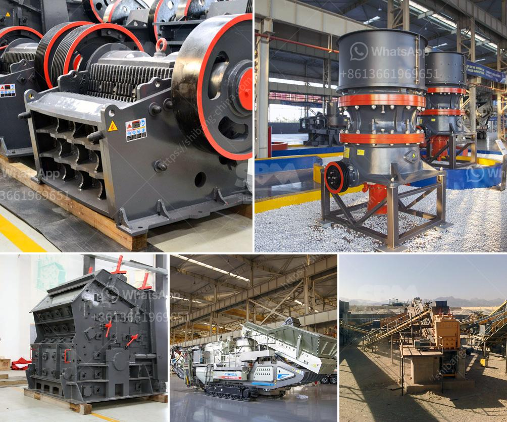

<h3>price of quarry crusher in zimbabwe</h3>
The price of quarry crusher in Zimbabwe depends on the specific model, capacity, and the quality of the equipment. As a professional manufacturer of crushing and grinding equipment in China, SBM Machinery provides a wide range of quarry crushers, such as jaw crushers, impact crushers, cone crushers, sand making machines, and hammer crushers. Each type of crusher has multiple models, ensuring that customers can choose the most suitable equipment for their quarry operations.

In Zimbabwe, the price of quarry crusher is an important consideration when it comes to evaluating its overall benefits and value. Based on years of experience, SBM develops high quality quarry crusher plant for sale in Zimbabwe. Jaw crusher, impact crusher, or gyratory crushers are usually used forprimary size reduction. The crusher product, normally 7.5 to 30 cm in diameter, and the grizzly throughs are discharged onto a belt conveyor and usually are conveyed to a surge pile for temporary storage or are sold as coarse aggregates.

Quarry crusher plant in Zimbabwe includes jaw crushers, impact crushers, cone crushers, and VSI crusher for tertiary crushing. The HSI crushers break rock by impacting the rock with hammers that are fixed upon the outer edge of a spinning rotor. HSI crushers can be used for wet or dry materials, but not sticky materials, and are usually not used for extremely hard and abrasive materials.

The price of quarry crusher in Zimbabwe is directly related to the size of the model, the equipment type, and the quality of the equipment. Generally speaking, the price of quarry crusher ranges from tens of thousands to hundreds of thousands of dollars. Therefore, when purchasing quarry crushing equipment in Zimbabwe, it is recommended to combine more to choose a suitable model and negotiate with a manufacturer to obtain a more favorable price. SBM, as a leading manufacturer and supplier of quarry crushers in Zimbabwe, offers a highly competitive price while ensuring the quality and performance of the equipment.
<h3>Contact us</h3><ul><li><strong>Whatsapp:&nbsp;<a href="https://wa.me/8613661969651">+8613661969651</a></strong></li><li><a href="https://swt.shibang-china.com/?git&amp;zhl&amp;price of quarry crusher in zimbabwe"><strong>Online Service(chat now)</strong></a></li></ul><h3>Related</h3><ul><li><a href='renting of screens and crushers.md'>renting of screens and crushers</a></li><li><a href='denver lab jaw crusher.md'>denver lab jaw crusher</a></li><li><a href='mobile crushers philippines.md'>mobile crushers philippines</a></li><li><a href='to buy medium mounted stone crusher in uk.md'>to buy medium mounted stone crusher in uk</a></li><li><a href='stearic acid coating machine for calcium carbonate.md'>stearic acid coating machine for calcium carbonate</a></li></ul>