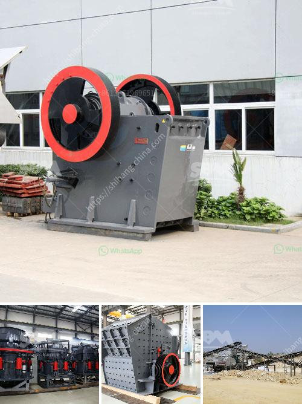

<h3>price of stone crush machine in pakistan</h3>
Stone crushing industry is a dominant but still environmentally unorganized sector in Pakistan. Its different operations cause significant environmental impacts including air and noise pollution in the vicinity as well as vibration effects far-off from the crushing site. To avoid such negative impacts, we should consider the specific issues involved in crushing machines and the control measures necessary to reduce them.

Stone crushing industry is an important industrial sector in the country and it plays an important role in the development of Pakistan economic. The choice of stone crusher is to get the building material we needed for project construction. The preferred equipment of stone crusher mainly includes jaw crusher, impact crusher and cone crusher. Jaw crusher has the characteristics of big crushing ratio, uniform product size, simple structure, reliable work, convenient repair, operating cost. Cone crusher is currently a good performance crusher, low power consumption and high production capacity during the crushing process, which is a greater advantage of the cone crusher. Therefore, although the materials produced by the cone crusher usually need to be shaped by a vertical impact crusher and a shaping sand making machine.

But in the large-scale stone crushing plant, single-stage jaw crusher is still the equipment of choice for the primary crushing of bulk materials. Impact crusher can be used as aggregate crushing equipment in secondary aggregate crushing process. It is used to crush crushed aggregate into fine aggregate. In the complete aggregate crushing plant, cone crusher is also used as fine aggregate crusher machine. Heavy Industry (Shanghai) is a professional aggregate crusher machine manufacturer in China. We can provide the best aggregate crushing machine for everyone.

The stone crushing plant includes stone crusher and stone mill or other related stone crushing machine. Stone mining has an important position in modern construction and road building industry because stone is the most widely used stone or rock. Our mobile cone crusher have exported to India, South Africa, Pakistan, Saudi Arabia, Nigeria, Kenya, Germany, Libya, Iran, Yemen, Pakistan, Tajikistan, Mexico, Chile, Angola, Egypt.

The price of stone crush machine in pakistan depends on the specific needs of the customers, so, it is necessary for the suppliers to provide excellent guidance and offer the suitable products for customers. The Crushing Process: The raw material can be easily quarried or extracted. The crushing ratio is desirable, the shape of the finished product is cubic, and the content of fine particles is relatively low. This crushing principle can effectively reduce the production cost. The final product has a low operating cost and a high recovery rate.

In conclusion, stone crush machines are very profitable in the construction industry. Crushing is necessary for various minerals and rocks, stones to be used in various construction applications. There are different types of machines used for crushing stones which include jaw crushers, impact crushers, cone crushers, and vertical impact crushers. The price of a stone crusher machine in Pakistan depends on the specific needs of the customers and the materials to be crushed. With different facilities and technical expertise, we can provide excellent guidance and offer the best solutions to help customers choose the most suitable products for their needs.
<h3>Contact us</h3><ul><li><strong>Whatsapp:&nbsp;<a href="https://wa.me/8613661969651">+8613661969651</a></strong></li><li><a href="https://swt.shibang-china.com/?git&amp;zhl&amp;price of stone crush machine in pakistan"><strong>Online Service(chat now)</strong></a></li></ul><h3>Related</h3><ul><li><a href='rock crusher machine in malaysia.md'>rock crusher machine in malaysia</a></li><li><a href='impact crusher machine supplier.md'>impact crusher machine supplier</a></li><li><a href='mobile mining gold equipment.md'>mobile mining gold equipment</a></li><li><a href='complete crushing plant 150 200t.md'>complete crushing plant 150 200t</a></li><li><a href='about aggregate crushing comoany in ethiopia.md'>about aggregate crushing comoany in ethiopia</a></li></ul>