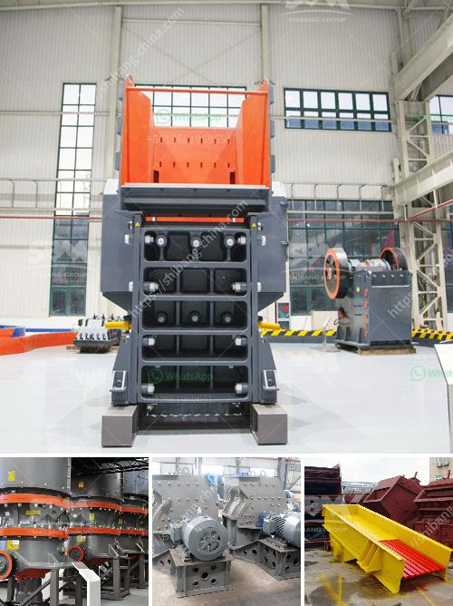

<h3>price of zenith stone crusher</h3>
1. The brand: the price of the equipment from different companies will vary, the brand awareness and reputation will also affect the price.  Some small manufacturers often adopt inferior raw materials and techniques to reduce costs, resulting in low price of equipment. Therefore, when purchasing a crusher, it is necessary to select a reliable brand and select equipment produced by regular manufacturers.

2. Production cost of equipment: the production cost of equipment is the main factor affecting the price of equipment. The higher the production cost, the higher the price of equipment. Because manufacturers need to invest more manpower, material resources and financial resources in equipment production, so the price of equipment is naturally higher.

3. Market demand: Market demand is also an important factor affecting the price of equipment. If the demand for equipment in the market is high, the price of equipment will naturally rise. Conversely, if the demand in the market is low, the price of equipment will be low. At present, the demand for stone crushers in the market is relatively high, so the price is higher than that of ordinary crushing equipment.

4. Specifications and models: The specifications and models of the equipment will affect the price of the equipment to some extent. The larger the model, the higher the price. In addition, different specifications and models also mean different production capacities and processing materials, so the price will also be different.

5. After-sales service: After-sales service is an important factor affecting the price of equipment. If the after-sales service is excellent, the price of the equipment will naturally be higher. A good after-sales service system can provide users with more convenient and efficient services, which can reduce the maintenance and use costs of the equipment in the later stage, so the price of the equipment will be higher.

In conclusion, the price of zenith stone crusher is affected by various factors, including brand, production cost, market demand, specifications and models, and after-sales service. Therefore, when choosing equipment, it is necessary to make a reasonable budget and consider multiple factors comprehensively, in order to purchase high-quality equipment at a reasonable price.
<h3>Contact us</h3><ul><li><strong>Whatsapp:&nbsp;<a href="https://wa.me/8613661969651">+8613661969651</a></strong></li><li><a href="https://swt.shibang-china.com/?git&amp;zhl&amp;price of zenith stone crusher"><strong>Online Service(chat now)</strong></a></li></ul><h3>Related</h3><ul><li><a href='crushing plant for river materials in europe.md'>crushing plant for river materials in europe</a></li><li><a href='sand crusher price.md'>sand crusher price</a></li><li><a href='conveyor belts kenya.md'>conveyor belts kenya</a></li><li><a href='used ballast crusher in uk.md'>used ballast crusher in uk</a></li><li><a href='mill ore grind size passing 200 mesh.md'>mill ore grind size passing 200 mesh</a></li></ul>