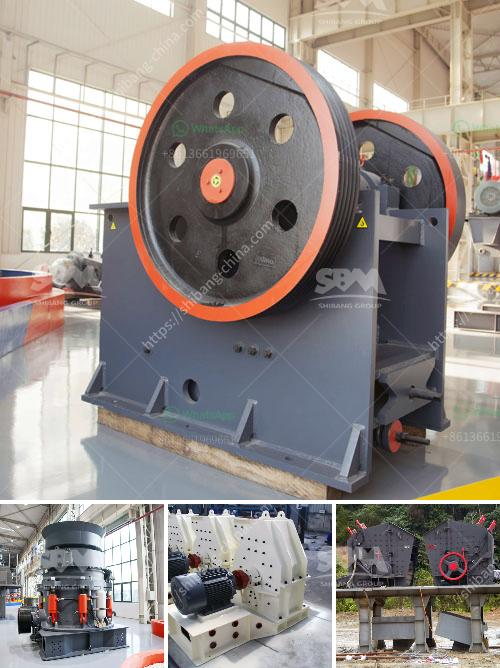

<h3>price of zenithcrusher plant</h3>
Are you in the market for a crusher plant? If so, you most likely want to ensure you are getting the best value for your money. With so many options available, it can be overwhelming to choose the right one for your needs. One brand that stands out among the rest is Zenith.

Zenith has been manufacturing and selling crusher plants for years, and they have built a solid reputation for their high-quality products. But what about the price? Let's dive into it.

You might be surprised to know that the price of a Zenith crusher plant is quite affordable when compared to other brands in the market. This does not mean that they compromise on quality. On the contrary, Zenith ensures that their products are of top-notch quality, no matter the price point.

The price of a Zenith crusher plant may vary depending on the specific model you are looking for. However, you can expect a fair and competitive price range that is suitable for most budgets. Zenith understands that their customers come from various backgrounds and industries, and they aim to provide a solution that is accessible to everyone.

One of the reasons why Zenith can offer their crusher plants at such a reasonable price is their commitment to efficiency and cost-effectiveness. They optimize their production processes to minimize waste and maximize productivity. By streamlining their operations, Zenith is able to pass on the savings to their customers.

Another factor that makes the price of Zenith crusher plants affordable is the long-term durability and reliability of their products. Investing in a crusher plant is a significant decision, and you want to be confident that it will last for years to come. With Zenith, you can rest assured knowing that their plants are built to withstand the toughest conditions and deliver consistent performance.

It's also worth mentioning that the price of a Zenith crusher plant includes excellent after-sales support. Should you encounter any issues or require assistance with maintenance or spare parts, Zenith's dedicated team is always ready to help. They are committed to providing the best customer service possible, ensuring that you get the most value out of your investment.

In conclusion, the price of a Zenith crusher plant is reasonable and well worth it. With their commitment to quality, efficiency, and customer satisfaction, you can trust that you are getting an excellent product at a fair price. Whether you are in the construction, mining, or any other industry that requires crushing equipment, Zenith is a brand you can rely on.

If you are considering purchasing a crusher plant, don't overlook Zenith. Take the time to explore their range of products and find the one that suits your needs and budget. You won't be disappointed with the price or the quality.
<h3>Contact us</h3><ul><li><strong>Whatsapp:&nbsp;<a href="https://wa.me/8613661969651">+8613661969651</a></strong></li><li><a href="https://swt.shibang-china.com/?git&amp;zhl&amp;price of zenithcrusher plant"><strong>Online Service(chat now)</strong></a></li></ul><h3>Related</h3><ul><li><a href='industrial crushing machines.md'>industrial crushing machines</a></li><li><a href='chinese companies looking for partners in africa.md'>chinese companies looking for partners in africa</a></li><li><a href='gypsum stone crusher.md'>gypsum stone crusher</a></li><li><a href='used stone crushers for sale in accra.md'>used stone crushers for sale in accra</a></li><li><a href='jaw crusher of zenith.md'>jaw crusher of zenith</a></li></ul>