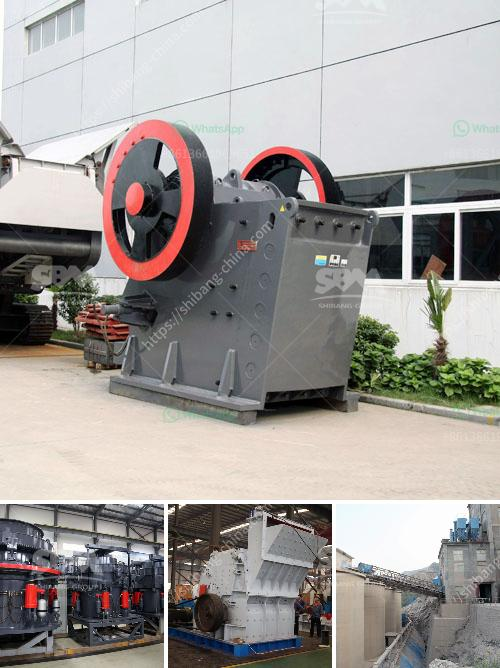

<h3>price pe 600 and 900 stone crusher</h3>
Stone crusher is a necessary equipment in mining machinery. It is mainly used to crush large stone into small or tiny particles. Due to its high production efficiency, reliable performance, and competitive price, stone crusher has been widely used in the industry of mining, cement, and other industries.

With the development of crushing technology, the types of stone crusher machines have become more and more diversified. There are jaw crusher, impact crusher, cone crusher, hammer crusher, roller crusher, and even different types of mobile crushers at the market. But they all have their own advantages and disadvantages.

PE 600 and 900 stone jaw crusher are classic stone crushing equipment in crushing plant, more and more clients want to choose jaw crusher machine. They can not only crush the hard rocks, such as granite, basalt, limestone, quartz, iron ore, but also stones and rocks such as slag, construction materials, marble, pebble, river stone, etc.
<h3>Contact us</h3><ul><li><strong>Whatsapp:&nbsp;<a href="https://wa.me/8613661969651">+8613661969651</a></strong></li><li><a href="https://swt.shibang-china.com/?git&amp;zhl&amp;price pe 600 and 900 stone crusher"><strong>Online Service(chat now)</strong></a></li></ul><h3>Related</h3><ul><li><a href='price of large jaw crusher.md'>price of large jaw crusher</a></li><li><a href='powder grinding mill price.md'>powder grinding mill price</a></li><li><a href='precipitated calcium carbonate plant.md'>precipitated calcium carbonate plant</a></li><li><a href='dry process of cement.md'>dry process of cement</a></li><li><a href='crushing machine for sale in nigeria.md'>crushing machine for sale in nigeria</a></li></ul>