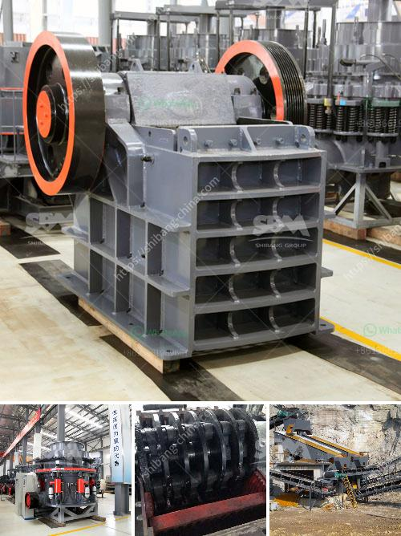

<h3>price three roll mill machinery</h3>
Three-roll mill machinery is an essential equipment used in the manufacturing industry. It is used to disperse, blend, and homogenize various kinds of materials into a uniform and smooth consistency. These machines are widely used in industries such as cosmetics, chemicals, pharmaceuticals, and food processing. The price range of three-roll mill machinery can vary depending on various factors.

One of the main factors that affect the price of three-roll mill machinery is the size and capacity of the machine. Larger machines with higher capacity will generally have a higher price tag compared to smaller and low capacity machines. The size and capacity of the machine should be chosen based on the specific needs of the industry and the volume of materials to be processed.

Another factor that affects the price of three-roll mill machinery is the brand and manufacturer. Well-known and reputable brands tend to have higher prices due to their quality and reliability. However, it is important to consider the overall quality and performance of the machine rather than just focusing on the price. A machine with a higher initial cost might provide better long-term value through its efficiency and durability.

The construction and design of the three-roll mill machinery also contribute to the price. Machines with more robust construction and advanced design features may have a higher price due to the materials used and the additional functionalities they offer. These machines are often built to withstand demanding industrial environments and can provide better performance and longevity.

The complexity of the control system and automation features can also affect the price. Machines with advanced control systems and automation capabilities may have a higher price due to the enhanced functionalities they offer. These features can improve the accuracy, repeatability, and ease of operation, which are essential for achieving consistent and high-quality results.

Additionally, the price of three-roll mill machinery can vary depending on the country of origin. Some countries may have lower labor or production costs, resulting in more competitively priced machinery. It is important to consider the reputation and quality of machinery from different countries to ensure a reliable and efficient machine.

When purchasing three-roll mill machinery, it is crucial to consider not only the price but also the overall value and suitability for the specific needs of the industry. It is recommended to get quotes from multiple suppliers and compare the specifications, features, and prices before making a decision. Additionally, reading reviews and seeking recommendations from industry professionals can provide valuable insights to make an informed choice.

In conclusion, the price of three-roll mill machinery can vary depending on factors such as size, capacity, brand, construction, control system, automation features, and country of origin. It is important to carefully evaluate the specifications, features, and overall quality of the machine before making a purchase decision. Investing in a high-quality and reliable three-roll mill machinery can improve productivity, efficiency, and the overall success of the manufacturing process.
<h3>Contact us</h3><ul><li><strong>Whatsapp:&nbsp;<a href="https://wa.me/8613661969651">+8613661969651</a></strong></li><li><a href="https://swt.shibang-china.com/?git&amp;zhl&amp;price three roll mill machinery"><strong>Online Service(chat now)</strong></a></li></ul><h3>Related</h3><ul><li><a href='chinese limestone mining investors.md'>chinese limestone mining investors</a></li><li><a href='trackmounted equipment.md'>track-mounted equipment</a></li><li><a href='crusher equipment in sweden.md'>crusher equipment in sweden</a></li><li><a href='magnetic separator manufacturers in turkey.md'>magnetic separator manufacturers in turkey</a></li><li><a href='price of diamond mining construction.md'>price of diamond mining construction</a></li></ul>