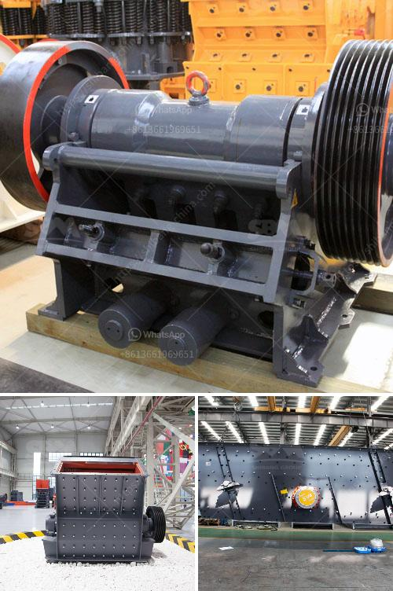

<h3>prices for cement processing machines</h3>
Cement processing machines play a pivotal role in the production and processing of cement. These machines are responsible for turning raw materials into the cement that we use in various construction projects. As a result, the prices of these machines vary depending on their capabilities, features, and quality.

One of the most common cement processing machines is the cement ball mill. This machine is equipped with steel balls of different sizes, and as the raw material passes through the mill, these balls grind it into a fine powder. The price of a cement ball mill can range from hundreds of thousands to millions of dollars, depending on the model and capacity.

Another important machine in cement processing is the cement crusher. This machine is used to crush the raw materials into smaller sizes before they are fed into the grinding mills. The price of a cement crusher can vary widely, depending on the capacity, brand, and specifications.

Cement kilns are also essential in cement processing as they are responsible for the final stage of the process, known as clinkerization. These kilns can be either vertical or rotary, and their prices depend on their size, fuel type, and level of automation. The prices of cement kilns can range from tens of thousands to millions of dollars.

In addition to these machines, other equipment such as cement silos, cement mixers, and conveyors are required for efficient cement processing. The prices of these machines vary depending on their capacity, quality, and level of automation.

When considering purchasing cement processing machines, it is crucial to strike a balance between quality and cost. Low-quality machines may come at a lower price but may lead to lower productivity, increased maintenance costs, and shorter lifespan. On the other hand, high-quality machines tend to have higher prices upfront, but they offer better performance, durability, and efficiency in the long run.

In conclusion, the prices of cement processing machines can vary significantly based on their capabilities, features, and quality. It is important for buyers to consider their specific requirements and budget when investing in these machines to ensure optimal performance and long-term cost-effectiveness.
<h3>Contact us</h3><ul><li><strong>Whatsapp:&nbsp;<a href="https://wa.me/8613661969651">+8613661969651</a></strong></li><li><a href="https://swt.shibang-china.com/?git&amp;zhl&amp;prices for cement processing machines"><strong>Online Service(chat now)</strong></a></li></ul><h3>Related</h3><ul><li><a href='cement plant in assam.md'>cement plant in assam</a></li><li><a href='marble jaw crusher.md'>marble jaw crusher</a></li><li><a href='silica quartz grinding mill 400 mash.md'>silica quartz grinding mill 400 mash</a></li><li><a href='used raymond mill for sale in taiwan crusher.md'>used raymond mill for sale in taiwan crusher</a></li><li><a href='gold crusher plant for sale australia.md'>gold crusher plant for sale australia</a></li></ul>