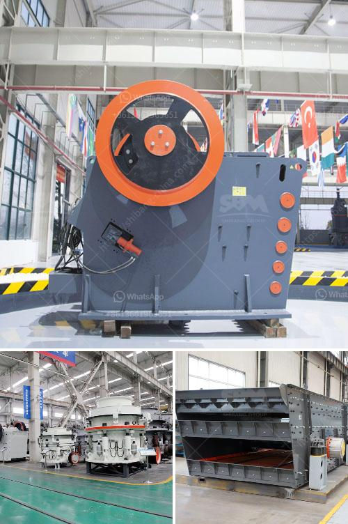

<h3>prices of gemini concentrating tables manufacturers</h3>
Gemini concentrating tables, also known as shaking tables, have gained popularity in the mining industry for their ability to separate and concentrate valuable minerals from ore. These tables are especially efficient in recovering fine gold particles and other heavy minerals.

When it comes to purchasing Gemini concentrating tables, there are several manufacturers to choose from. Each manufacturer offers their own unique designs, features, and price points. The prices of Gemini concentrating tables can vary depending on factors such as the table size, capacity, and additional features.

On average, the prices of Gemini concentrating tables range from $5,000 to $15,000. However, it is important to note that these prices are approximate and can vary significantly depending on the manufacturer and specific configuration.

Some manufacturers offer entry-level Gemini tables with basic features at lower prices, making them more accessible for small-scale miners or those on a tight budget. These tables typically have smaller capacities and fewer customization options.

On the other hand, higher-priced options are available for those who require more advanced features, larger capacities, or specific customization options. These tables often incorporate innovative technologies that enhance efficiency and ensure optimal mineral recovery.

It is worth mentioning that while purchasing a Gemini concentrating table, it is crucial to consider factors beyond price alone. Quality, durability, after-sales service, and reputation of the manufacturer should also be taken into account. Investing in a high-quality table from a reputable manufacturer can result in better long-term performance and increased productivity for mining operations.

Ultimately, the prices of Gemini concentrating tables from manufacturers can vary, and it is important to research and compare different options before making a decision. Considering the specific needs and budget of the mining operation is essential in order to select the most suitable table that can deliver optimal results.
<h3>Contact us</h3><ul><li><strong>Whatsapp:&nbsp;<a href="https://wa.me/8613661969651">+8613661969651</a></strong></li><li><a href="https://swt.shibang-china.com/?git&amp;zhl&amp;prices of gemini concentrating tables manufacturers"><strong>Online Service(chat now)</strong></a></li></ul><h3>Related</h3><ul><li><a href='cement manufacturing equipment pdf.md'>cement manufacturing equipment pdf</a></li><li><a href='kenya jaw crushers south africa.md'>kenya jaw crushers south africa</a></li><li><a href='vibrator machine for concrete.md'>vibrator machine for concrete</a></li><li><a href='pulverizer crusher manufacturer in rajkot india.md'>pulverizer crusher manufacturer in rajkot india</a></li><li><a href='vibrating screens for material crusher.md'>vibrating screens for material crusher</a></li></ul>