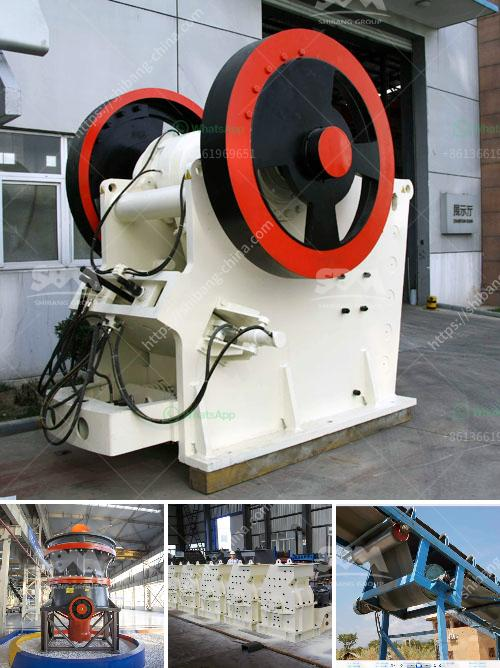

<h3>process of crushing stones</h3>
Crushing stones is a tedious and delicate process. The stones need to be carefully fed into the crusher machine in order to obtain the desired results. There are three stages of crushing in order to crush stones properly.

Firstly, the stones are gathered and placed on a conveyor belt. They are sent into the primary crusher where they are broken down into smaller pieces. This primary crusher is usually a jaw crusher or gyratory crusher, which consists of a stationary plate, allows for smooth and continuous flow of the material. The stones are moved towards the crushing chamber and are gradually crushed by the powerful force exerted by the rotating plates.

Once the stones are reduced in size, they move onto the secondary crusher. This crusher further breaks down the stones into even smaller pieces, ensuring a more uniform size. The secondary crusher can be a cone crusher or an impact crusher, depending on the application requirements. These machines use compression force to break the stones and provide a more refined final product.

Finally, the crushed stones move onto the vibrating screen, which separates them based on their size. The vibrating screen consists of a meshed panel that allows the smaller particles to fall through, while the larger ones are carried forward for further processing. This ensures that the stones are properly graded for different applications. Once the desired size is obtained, the stones can be used for various purposes such as construction, landscaping, or even as raw materials in the manufacturing industry.

Crushing stones is a crucial process in various industries and plays a significant role in creating various products. It requires precision, careful handling, and the use of specialized machinery. The process ensures that the end product is of high quality and meets the requirements of the industry. Therefore, it is essential to follow each step of the crushing process to obtain the desired results.
<h3>Contact us</h3><ul><li><strong>Whatsapp:&nbsp;<a href="https://wa.me/8613661969651">+8613661969651</a></strong></li><li><a href="https://swt.shibang-china.com/?git&amp;zhl&amp;process of crushing stones"><strong>Online Service(chat now)</strong></a></li></ul><h3>Related</h3><ul><li><a href='aggregate crusher equipment.md'>aggregate crusher equipment</a></li><li><a href='stone crushing machine for sale.md'>stone crushing machine for sale</a></li><li><a href='rock crusher machine.md'>rock crusher machine</a></li><li><a href='conveyor belts nigeria.md'>conveyor belts nigeria</a></li><li><a href='complete gold mining equipment for small scale mines.md'>complete gold mining equipment for small scale mines</a></li></ul>