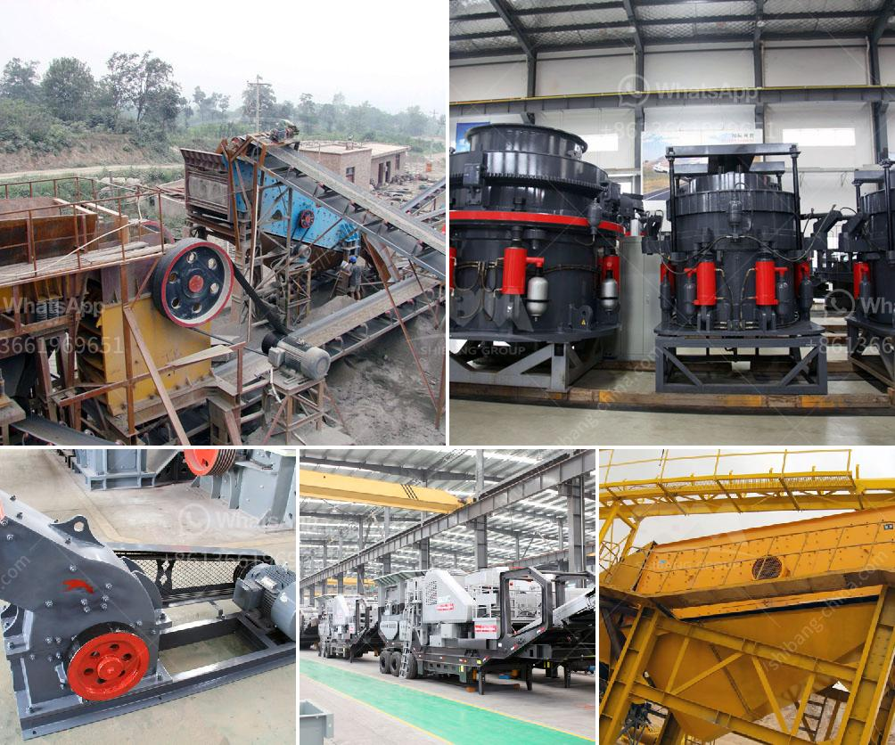

<h3>process of making diamonds from coal</h3>
Diamonds have forever fascinated mankind with their exquisite beauty and unmatched hardness. These gemstones are renowned for symbolizing love, luxury, and eternity. Contrary to popular belief, diamonds are not made from coal; however, both are derived from carbon. The process of creating these mesmerizing stones involves remarkable natural forces acting over millions of years. So, let us delve into the fascinating journey of transforming carbon into the most coveted gemstone – the diamond.

The journey begins deep beneath the Earth's surface, where carbon-rich materials are subjected to immense heat and pressure. This process occurs in the upper mantle, approximately 140 to 190 kilometers below the crust. The extreme conditions in this region create the fruitful environment for diamond formation. However, coal does not possess the necessary carbon purity for diamond creation. Instead, it is carbon-rich minerals or organic materials that generate the initial carbon source.

This remarkable transformation begins with the subduction of tectonic plates, where one plate slides beneath another, pushing crustal material deeper into the mantle. As these materials descend, intense heat and pressure cause carbon atoms to arrange themselves in unique crystal structures. Temperature and pressure gradients within the Earth's mantle allow carbon atoms to bond together, forming diamond crystals.

Over millions of years, geological processes continue to exert force on these diamond crystals. As tectonic movements occur, the uplift of the mantle transports the diamonds closer to the Earth's surface. Volcanic eruptions serve as an essential conduit for diamonds to reach the surface. These eruptions, known as kimberlite or lamproite eruptions, carry diamonds and other valuable minerals from the mantle to the Earth's crust at breakneck speeds. The speed and force generated during these eruptions push the diamonds up, allowing them to be found in certain regions where volcanic activity has occurred.

Despite this incredible journey, the majority of diamonds never reach the surface. Only around 20% of diamonds are of gem-quality, while the remaining 80% are used for industrial purposes due to their hardness. Diamond mining, both onshore and offshore, is a labor-intensive and meticulous endeavor. Miners must sift through vast quantities of rock and sediment to uncover the elusive treasures hidden within.

Once these valuable gemstones are extracted, they are subjected to cutting, shaping, and polishing techniques. Expert diamond cutters meticulously assess each stone, considering its unique characteristics, in order to achieve the maximum brilliance and beauty. The skill and artistry of diamond cutting is essential, as it determines the final appearance and the overall value of the stone.

While most natural diamonds go through this arduous process, advancements in technology have enabled scientists to replicate it in the laboratory. Lab-grown diamonds, also known as synthetic diamonds, are created by simulating the conditions found in the Earth's mantle. Through chemical vapor deposition or high-pressure, high-temperature methods, carbon is converted into diamonds within a matter of weeks.

In conclusion, the journey from carbon to a dazzling diamond is truly captivating. While the notion of coal transforming into diamonds is a popular misconception, both are connected by their carbon base. The geological forces at play within the Earth's mantle, combined with volcanic activity, shape the precious gemstone we know and love. Whether created naturally or synthesized in a laboratory, diamonds remain an ultimate symbol of beauty, elegance, and timeless allure.
<h3>Contact us</h3><ul><li><strong>Whatsapp:&nbsp;<a href="https://wa.me/8613661969651">+8613661969651</a></strong></li><li><a href="https://swt.shibang-china.com/?git&amp;zhl&amp;process of making diamonds from coal"><strong>Online Service(chat now)</strong></a></li></ul><h3>Related</h3><ul><li><a href='belt cost conveyor.md'>belt cost conveyor</a></li><li><a href='used stone crusher mini plant india.md'>used stone crusher mini plant india</a></li><li><a href='manufacturer of balls of ball mill in india.md'>manufacturer of balls of ball mill in india</a></li><li><a href='mobile jaw crusher equipment.md'>mobile jaw crusher equipment</a></li><li><a href='stone quarry drill machine crushers prices.md'>stone quarry drill machine crushers prices</a></li></ul>