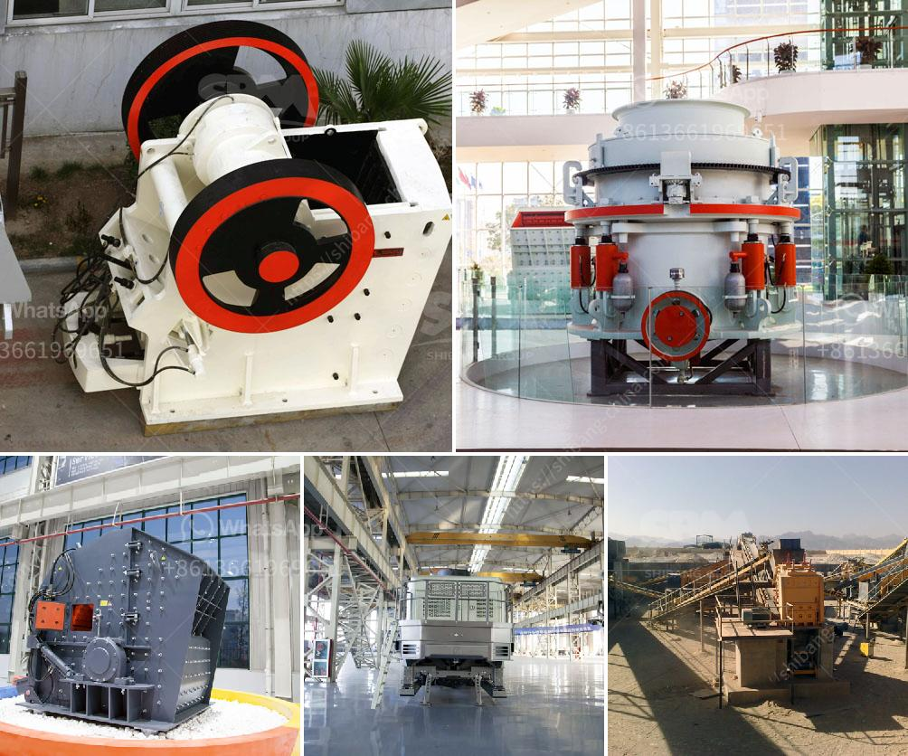

<h3>process of mining silica rock crusher</h3>
The process of mining silica rock crusher is fairly straightforward. First, explosives are used to blast the rock into smaller pieces. The blasted material is then loaded into trucks and transported to the crushing plant. At the crushing plant, the rocks are crushed into smaller sizes using a jaw crusher or similar equipment.

Once the rocks are crushed, they are transported to a vibrating screen, where different sizes of silica particles are separated. The larger particles are sent back to the crusher for further crushing, while the smaller particles are sorted into different grades.

After the size separation process, the silica rock is washed to remove impurities such as clay and dirt. This is typically done in a washing plant using water and various chemicals. The washed silica rock is then sent to a drying facility, where it is heated to remove any remaining moisture.

Once dried, the silica rock is milled into a fine powder using a ball mill or similar equipment. This powder is then ready to be used in various industries. Silica rock is commonly used in the production of glass, ceramics, concrete, and other construction materials.

In conclusion, the process of mining silica rock crusher involves blasting, crushing, size separation, washing, drying, and milling. This process is vital for obtaining high-quality silica rock that can be used in a wide range of industries. It requires careful planning, proper equipment, and skilled workers to ensure the efficient and safe extraction of silica rock.
<h3>Contact us</h3><ul><li><strong>Whatsapp:&nbsp;<a href="https://wa.me/8613661969651">+8613661969651</a></strong></li><li><a href="https://swt.shibang-china.com/?git&amp;zhl&amp;process of mining silica rock crusher"><strong>Online Service(chat now)</strong></a></li></ul><h3>Related</h3><ul><li><a href='coal mill company in srilanka.md'>coal mill company in srilanka</a></li><li><a href='mobile coal cone crusher provider malaysia.md'>mobile coal cone crusher provider malaysia</a></li><li><a href='vertical roller mill.md'>vertical roller mill</a></li><li><a href='coal washing plant cost.md'>coal washing plant cost</a></li><li><a href='conveyor belt for fly ash.md'>conveyor belt for fly ash</a></li></ul>