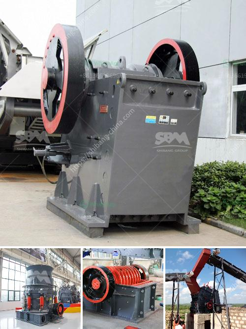

<h3>process of preparation of coal and asha</h3>
Coal and ash are two essential components in various industries and energy production processes. The preparation of coal and ash plays a crucial role in ensuring their quality and suitability for specific applications. In this article, we will explore the process of coal and ash preparation in detail.

Coal, a fossil fuel formed from plant remains, is primarily used as a source of energy. The preparation process of coal involves several stages to eliminate impurities and enhance its energy content. The most common method of coal preparation is washing, which removes impurities like ash, sulfur, and rock.

The first step in coal preparation is crushing and sizing. This process involves breaking down the coal into smaller pieces and segregating them into different sizes. The coal is crushed to achieve a uniform size distribution, which improves its combustion efficiency. Sizing ensures that the coal particles are of the desired size for the specific application.

After crushing and sizing, the coal goes through a process called screening. Screening separates the coal particles based on their size or density. It removes the fines (small-sized particles) and any oversized chunks. This step ensures a more uniform distribution of coal sizes and eliminates impurities like dirt and clay.

Once the coal is screened, it may undergo further processing through dense medium separation. This process utilizes a dense medium, typically a suspension of finely ground magnetite or ferrosilicon, to separate coal from impurities. The coal floats on top of the medium while the heavier impurities sink. This separation technique is highly efficient in removing sulfur, ash, and rock from coal.

The final stage of coal preparation is dewatering. Dewatering removes moisture from the coal, making it more suitable for combustion. This process is commonly achieved through thermal drying or mechanical means like centrifuges or filters.

In contrast to coal preparation, the preparation of ash involves the treatment of by-products left after burning coal. Ash consists of inorganic materials such as silica, alumina, iron, and calcium compounds. The preparation of ash usually involves two main processes: combustion and disposal.

When coal is combusted, the organic matter burns off, leaving behind ash. The composition of ash varies depending on the coal type and the combustion conditions. The two types of ash commonly produced are fly ash and bottom ash. Fly ash is the fine particles that are carried away with the flue gas, while bottom ash is the larger, heavier particles that settle at the bottom of the combustion chamber.

Fly ash undergoes several processes to make it suitable for various applications. It is primarily collected through electrostatic precipitators or fabric filters, which capture the ash particles. The collected ash may then undergo further treatment, such as grinding and classification, to enhance its fineness and uniformity. This processed fly ash can be used in cement production, concrete, and as a component in the construction industry.

On the other hand, bottom ash is typically collected by water quenching or dry extraction methods. It may undergo crushing or grinding to reduce its size, making it suitable for use as an aggregate in construction materials like road bases or as a raw material in the production of cement and bricks.

In conclusion, the preparation of coal and ash involves several stages to ensure their quality and suitability for specific applications. Coal is prepared through processes like crushing, sizing, screening, dense medium separation, and dewatering, while ash is prepared by treating the by-products of coal combustion. These processes play a crucial role in optimizing the properties of coal and ash, enabling their utilization in various industries.
<h3>Contact us</h3><ul><li><strong>Whatsapp:&nbsp;<a href="https://wa.me/8613661969651">+8613661969651</a></strong></li><li><a href="https://swt.shibang-china.com/?git&amp;zhl&amp;process of preparation of coal and asha"><strong>Online Service(chat now)</strong></a></li></ul><h3>Related</h3><ul><li><a href='feldspar powder making machine in india.md'>feldspar powder making machine in india</a></li><li><a href='ball mills as size reduction equipment.md'>ball mills as size reduction equipment</a></li><li><a href='mobile coal cone crusher provider malaysia.md'>mobile coal cone crusher provider malaysia</a></li><li><a href='stone crushing plant manufacturers.md'>stone crushing plant manufacturers</a></li><li><a href='quarry machines and prices.md'>quarry machines and prices</a></li></ul>