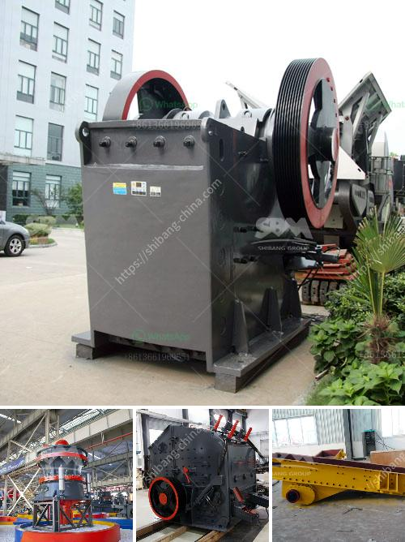

<h3>process of river rock crushing to make cement</h3>
River rock is a type of stone that is commonly used in construction projects. It comes in various sizes and shapes, ranging from small pebbles to larger boulders. One of the main applications of river rock is in the production of cement. To obtain the necessary materials for cement production, the process of river rock crushing is essential.

The first step in the process of river rock crushing is the extraction of the raw materials. Once the river rock is harvested from the earth, it is transported to a crushing facility. Here, the rocks are put through a series of crushing machines to reduce them to a size that is suitable for cement production. This crushing process is crucial, as it ensures that the river rock is finely crushed for efficient use in cement manufacturing.

After the river rock is crushed, it undergoes a screening process to separate the different sizes of rocks. The smaller rocks are used as aggregates in the production of cement, while the larger rocks are often used for landscaping or other purposes. The screening process helps to ensure that only the appropriate sizes of river rock are used in cement production.

Once the river rock has been crushed and screened, it is then mixed with other materials to create cement. Typically, these materials include limestone, clay, and gypsum. The river rock is combined with these materials in the correct proportions and then heated in a kiln at high temperatures. This heating process, known as calcination, helps to transform the raw materials into cement.

Overall, the process of river rock crushing to make cement is a crucial step in cement manufacturing. It involves extracting the raw materials, crushing and screening the river rock, and combining it with other materials to create cement. Through this process, river rock is transformed into a vital component of construction materials, ensuring the durability and strength of various structures.
<h3>Contact us</h3><ul><li><strong>Whatsapp:&nbsp;<a href="https://wa.me/8613661969651">+8613661969651</a></strong></li><li><a href="https://swt.shibang-china.com/?git&amp;zhl&amp;process of river rock crushing to make cement"><strong>Online Service(chat now)</strong></a></li></ul><h3>Related</h3><ul><li><a href='500 tph stone crusher price.md'>500 tph stone crusher price</a></li><li><a href='china coal mill grinder manufacturers china.md'>china coal mill grinder manufacturers china</a></li><li><a href='slag vertical mill.md'>slag vertical mill</a></li><li><a href='used stone crusher ontario.md'>used stone crusher ontario</a></li><li><a href='aggregates plant for construction.md'>aggregates plant for construction</a></li></ul>