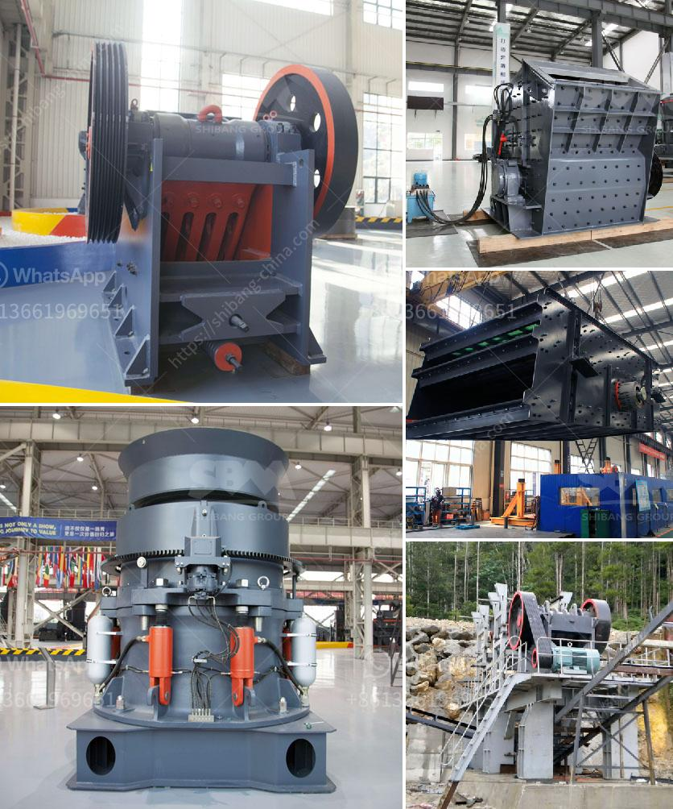

<h3>processing of zirconium sand milling</h3>
Processing of zirconium sand milling is a crucial step in the production of zirconia-based materials, which have numerous applications in various industries. Zirconia is known for its exceptional strength, durability, and resistance to high temperatures, making it an ideal material for applications such as ceramics, refractory coatings, dental implants, and even jewelry.

The processing of zirconium sand milling involves several stages to achieve the desired particle size and purity. The first step is the extraction of zirconium sand from the mineral zircon, which is typically found in beach sand deposits. The sand is then purified through a series of chemical and physical processes to remove impurities and unwanted minerals.

Once the zirconium sand is purified, it is then milled to reduce its particle size. The milling process is typically carried out using a ball mill, where the grinding media such as ceramic balls or stainless steel balls are used to create a fine powder from the sand. The milling action and the speed of rotation of the mill determine the fineness of the zirconium sand powder.

After milling, the zirconium sand powder may undergo further processing steps such as drying, sieving, and classification. Drying removes any remaining moisture from the powder to improve its flow properties and prevent clumping. Sieving is done to separate the powder into different size fractions, while classification helps to further refine the particle size distribution.

The milled zirconium sand powder is then ready for use in various applications. In the ceramic industry, it is often used as a raw material for the production of zirconia-based ceramics, which have excellent mechanical and thermal properties. The powder can be mixed with other ceramic powders and binders to form a homogeneous mixture, which is then shaped into the desired form and fired at high temperatures to create the final ceramic product.

In the manufacturing of refractory coatings, the milled zirconium sand powder is typically mixed with other refractory materials and binders to create a slurry. The slurry is then applied to the surface of a substrate, such as metal or concrete, and dried or heat-treated to form a hard, protective coating. This coating is resistant to high temperatures and corrosion, making it suitable for applications in the aerospace, automotive, and petrochemical industries.

Dental implants are another important application of zirconia-based materials. The milled zirconium sand powder is mixed with other materials and shaped into the desired dental implant structure. The implant is then sintered at high temperatures to create a strong and biocompatible material that can be safely inserted into the patient's jawbone.

In conclusion, the processing of zirconium sand milling plays a vital role in the production of zirconia-based materials with exceptional properties. Through a series of purification, milling, and further processing steps, the zirconium sand is transformed into a fine powder that can be used in a wide range of applications across various industries. From ceramics to refractory coatings and dental implants, zirconia-based materials have revolutionized many industries with their superior strength, durability, and thermal resistance.
<h3>Contact us</h3><ul><li><strong>Whatsapp:&nbsp;<a href="https://wa.me/8613661969651">+8613661969651</a></strong></li><li><a href="https://swt.shibang-china.com/?git&amp;zhl&amp;processing of zirconium sand milling"><strong>Online Service(chat now)</strong></a></li></ul><h3>Related</h3><ul><li><a href='conveyor belt equipment for mining south africa.md'>conveyor belt equipment for mining south africa</a></li><li><a href='belt conveyor 12mm.md'>belt conveyor 12mm</a></li><li><a href='stone crusher of aar.md'>stone crusher of aar</a></li><li><a href='stone crusher plant price.md'>stone crusher plant price</a></li><li><a href='quarry crusher machine.md'>quarry crusher machine</a></li></ul>