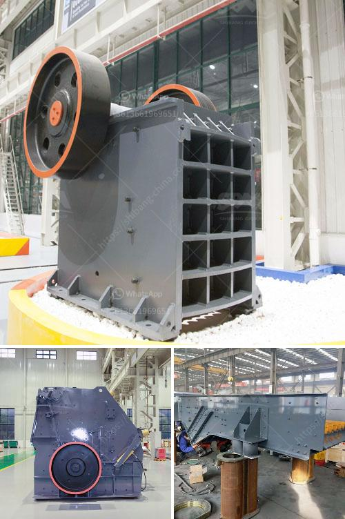

<h3>processing on barite crushing</h3>
Barite is a mineral that has gained significant importance over the years due to its wide range of applications in various industries. It is a common ore of barium, a heavy metal that is known for its high density and chemical inertness. Barite is primarily composed of barium sulfate (BaSO4) and is found in large quantities across the globe.

One of the most crucial steps in the utilization of barite is its processing, particularly during the crushing stage. Crushing is necessary to reduce the ore size from exploration-sized fragments to a granular form suitable for further processing. This article delves into the various methods and equipment used in barite crushing, highlighting the importance of a well-designed crushing circuit.

The primary goal of the crushing process is to minimize the size of the barite particles and achieve a suitable particle size range for its subsequent use. Crushing can be accomplished using different types of equipment, depending on the characteristics of the feed material and the desired final product size. Typically, jaw crushers, gyratory crushers, and impact crushers are used for primary crushing, while cone crushers and hammer crushers are used for secondary and tertiary crushing.

Jaw crushers are commonly used for a primary crushing application, as they are capable of handling large feed sizes and have a high reduction ratio. Gyratory crushers, on the other hand, possess a conical head and a concave surface, which provide a higher capacity and a uniform product size. Impact crushers, both horizontal and vertical shaft variations, are effective for producing a cubical-shaped final product.

Once the primary crushing is completed, secondary and tertiary crushers are employed to further reduce the size of the barite particles. Cone crushers are commonly used for secondary crushing due to their ability to produce a well-graded and cubical final product. Hammer crushers, alternatively, are suitable for tertiary crushing, as they produce a consistent and finer product size.

After crushing, the barite particles undergo further processing steps to separate impurities and obtain a high-quality product. The collected ore is then ground to a fine powder using specialized mills, such as Raymond mills or ball mills. These mills utilize the impact and shear forces between the grinding media and the ore particles to break them down.

In conclusion, the processing of barite is a critical step that involves crushing the ore to the desired particle size. Several types of crushers, including jaw crushers, gyratory crushers, impact crushers, cone crushers, and hammer crushers, are used for this purpose. The choice of crusher depends on the characteristics of the feed material and the desired final product size. Successful barite processing ensures the production of a high-quality product that meets the requirements of various industries, including oil and gas drilling, paint and coatings, and healthcare.
<h3>Contact us</h3><ul><li><strong>Whatsapp:&nbsp;<a href="https://wa.me/8613661969651">+8613661969651</a></strong></li><li><a href="https://swt.shibang-china.com/?git&amp;zhl&amp;processing on barite crushing"><strong>Online Service(chat now)</strong></a></li></ul><h3>Related</h3><ul><li><a href='denver lab jaw crusher.md'>denver lab jaw crusher</a></li><li><a href='vsi crusher manufacturer.md'>vsi crusher manufacturer</a></li><li><a href='low cost jaw crusher price.md'>low cost jaw crusher price</a></li><li><a href='portable crushing equipment.md'>portable crushing equipment</a></li><li><a href='crusher in sale in nepal.md'>crusher in sale in nepal</a></li></ul>