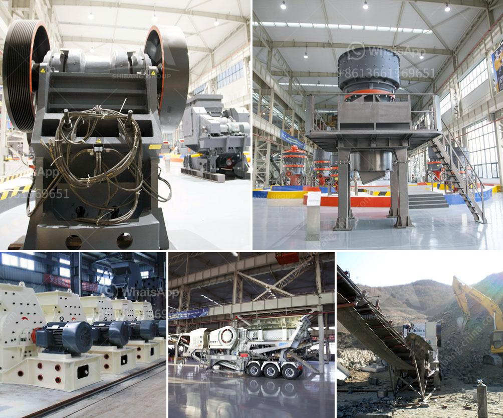

<h3>product curve jaw crusher</h3>
The product curve Jaw Crusher is a modern and efficient crushing equipment that is developed by introducing advanced technology from abroad and combining with the specific industrial and mining conditions of the domestic market. It adopts advanced crushing technology and unique structural design, making the finished product cubic-shaped without tension and cracks, and improving the production capacity and crushing efficiency.

The product curve Jaw Crusher is widely used in various materials processing of mining and construction industries, such as it is suit for crushing granite, marble, basalt, limestone, quartz, cobble, iron ore, copper ore, and some other mineral and rocks. With its high crushing ratio, large capacity, and low power consumption, it can crush materials with strength less than 320MPa.

The product curve Jaw Crusher adopts a compact and robust structure, and optimizes the movement parameters of the movable jaw, creating a high crushing ratio and ensuring the uniformity of the crushed materials. The deep V-shaped crushing chamber design allows the raw materials to be fully crushed, ensuring the stability and reliability of the equipment in operation.

In addition, the product curve Jaw Crusher is equipped with a hydraulic overload protection system, which automatically opens the relief valve to protect the equipment when the non-crushable materials enter the crushing chamber. This greatly improves the safety of the production process and avoids the damage caused by excessive load.

Overall, the product curve Jaw Crusher is a reliable and efficient crushing equipment that is widely used in various industries. It provides high-quality finished products, improves production efficiency, and enhances the competitiveness of enterprises. With its advanced technology and excellent performance, it has become an essential equipment for many industries.
<h3>Contact us</h3><ul><li><strong>Whatsapp:&nbsp;<a href="https://wa.me/8613661969651">+8613661969651</a></strong></li><li><a href="https://swt.shibang-china.com/?git&amp;zhl&amp;product curve jaw crusher"><strong>Online Service(chat now)</strong></a></li></ul><h3>Related</h3><ul><li><a href='beast crusher price.md'>beast crusher price</a></li><li><a href='lime dolomite plant processing.md'>lime dolomite plant processing</a></li><li><a href='used stone crusher for sale in italy.md'>used stone crusher for sale in italy</a></li><li><a href='feldspar powder making machine in india.md'>feldspar powder making machine in india</a></li><li><a href='crusher plant in sri lanka.md'>crusher plant in sri lanka</a></li></ul>