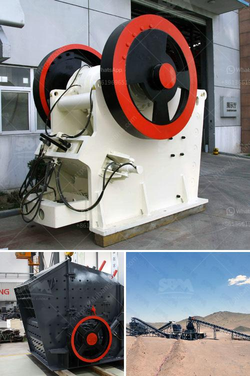

<h3>production process clinker zurich switzerland</h3>
The production process of clinker in Zurich, Switzerland is a vital component in the construction industry. Clinker, a key ingredient in cement production, is responsible for giving the final product its strength and durability. The production process in Zurich is known for its efficiency, sustainability, and adherence to strict quality standards.

Zurich, being a hub for innovation and technology, embraces advanced manufacturing techniques in the clinker production process. One of the primary steps is the extraction of raw materials, which primarily include limestone and clay. These raw materials are carefully chosen and blended to ensure the optimal chemical composition for clinker production.

Once the raw materials are extracted, they are transported to the production facility, where they undergo a series of processes. The first step is crushing and grinding the raw materials into a fine powder. This powdered mixture is then fed into a kiln, which is a large, cylindrical furnace.

In the kiln, the powdered mixture is subjected to extremely high temperatures reaching up to 1500 degrees Celsius. This process is called calcination, during which the raw materials undergo a chemical reaction, resulting in the formation of clinker nodules. The intense heat causes the materials to fuse together, creating small, marble-sized clinker nodules.

After the calcination process, the clinker nodules are cooled down rapidly to maintain their desired properties. The cooling process is carefully controlled, ensuring uniform cooling throughout the clinker. This step is crucial to prevent any potential defects or irregularities in the final product.

Once the clinker is cool, it undergoes further grinding to obtain a fine powder known as cement. This grinding process involves the use of specialized equipment, such as ball mills, to reduce the clinker particles to the desired size. The finely ground cement is then stored in silos, waiting for its final application.

The clinker production process in Zurich is not only efficient but also highly sustainable. The production facilities utilize state-of-the-art technologies to minimize energy consumption and reduce emissions. Efforts are made to harness renewable energy sources, such as solar and wind power, to meet the electricity needs of the production process.

Additionally, waste heat recovery systems are employed to capture and reuse the heat generated during the production process. This not only reduces energy wastage but also helps to cut down on greenhouse gas emissions. Furthermore, the production facilities focus on waste management strategies to minimize environmental impact by recycling and reusing waste materials.

The production process of clinker in Zurich, Switzerland, is a complex and carefully orchestrated sequence of steps. The meticulous selection of raw materials, the high-temperature calcination process, and the adherence to sustainable practices contribute to the production of high-quality clinker. As Zurich continues to prioritize innovation and sustainability, the clinker production process will undoubtedly evolve to further enhance efficiency and environmental performance.
<h3>Contact us</h3><ul><li><strong>Whatsapp:&nbsp;<a href="https://wa.me/8613661969651">+8613661969651</a></strong></li><li><a href="https://swt.shibang-china.com/?git&amp;zhl&amp;production process clinker zurich switzerland"><strong>Online Service(chat now)</strong></a></li></ul><h3>Related</h3><ul><li><a href='list of quarry crusher company in the philippines.md'>list of quarry crusher company in the philippines</a></li><li><a href='cement clinker grinding ball mill manufacturer india.md'>cement clinker grinding ball mill manufacturer india</a></li><li><a href='price for ball mills.md'>price for ball mills</a></li><li><a href='prices for cement processing machines.md'>prices for cement processing machines</a></li><li><a href='portable sand and gravel wash plants for sale.md'>portable sand and gravel wash plants for sale</a></li></ul>