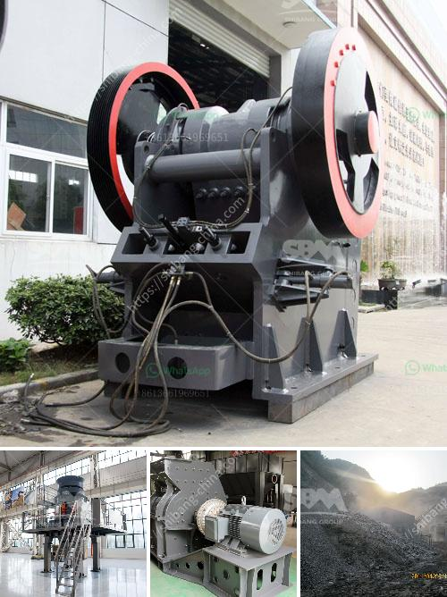

<h3>production process of gypsum</h3>
The production process of gypsum involves mining, crushing, grinding, drying, and calcining. Gypsum is extracted from the mines in the form of rock, which is then crushed and ground into a fine powder. Following this, the powder is dried in rotary dryers to reduce moisture content and improve the end product’s quality.

The first step in gypsum production is the extraction of gypsum ore from the mines. These mines are situated in different parts of the world, and the extracted gypsum is transported to nearby processing plants. Here, the ore is crushed using crushers, resulting in pieces of varying sizes.

The next step in the production process is grinding the crushed gypsum ore into a fine powder. This can be done using various types of mills such as ball mills, high-pressure grinding rolls (HPGR), or vertical roller mills (VRM). The ground gypsum powder is then classified into different sizes using classifiers. The size classification helps in controlling the final product’s quality and meeting specific customer requirements.

After grinding, the gypsum powder is then dried in a rotary dryer. The drying process helps remove excess moisture content, making the powder suitable for further processing and improving its handling and storage properties. The drying is typically done using hot gases, such as natural gas or coal, which are circulated through the dryer. The temperature and airflow are carefully controlled to ensure optimal drying conditions.

Once dried, the gypsum powder is sent for calcination in a calciner or kettle. Calcination is a high-temperature process that involves heating the powder to around 150-165 degrees Celsius. This step drives off the remaining moisture content and chemically converts the gypsum to its final form, calcium sulfate hemihydrate or Plaster of Paris (POP).

The calcined gypsum, or POP, is then crushed and ground again to achieve the desired particle size. Depending on the application, additives such as retarders or accelerators may be added to control the setting time of the gypsum. The ground gypsum is then stored in silos or packed into bags for distribution.

The production process of gypsum is highly standardized and controlled to ensure consistent quality and performance of the final product. Quality control measures are implemented at each stage of the process, including monitoring the ore composition, grinding parameters, drying conditions, and calcination temperature.

Gypsum finds extensive use in various industries, including construction, agriculture, and manufacturing. In the construction industry, gypsum is used to make plasterboards, drywall, and other building materials. In agriculture, gypsum is added to soil to improve its fertility and water-holding capacity. In manufacturing, gypsum is utilized in the production of ceramics, cement, and as a filler or additive in various industrial processes.

In conclusion, the production process of gypsum involves mining, crushing, grinding, drying, and calcining to produce high-quality gypsum powder. The standardized production ensures consistent quality, and gypsum finds wide applications in construction, agriculture, and manufacturing. With its versatile properties, gypsum continues to play a vital role in various industries around the world.
<h3>Contact us</h3><ul><li><strong>Whatsapp:&nbsp;<a href="https://wa.me/8613661969651">+8613661969651</a></strong></li><li><a href="https://swt.shibang-china.com/?git&amp;zhl&amp;production process of gypsum"><strong>Online Service(chat now)</strong></a></li></ul><h3>Related</h3><ul><li><a href='mobile gold processing plant 1 2 tph.md'>mobile gold processing plant 1 2 tph</a></li><li><a href='types of stone crusher and prices.md'>types of stone crusher and prices</a></li><li><a href='crusher plant in sri lanka.md'>crusher plant in sri lanka</a></li><li><a href='egypt gold prospecting equipment manufacturers.md'>egypt gold prospecting equipment manufacturers</a></li><li><a href='manganese metal production process.md'>manganese metal production process</a></li></ul>