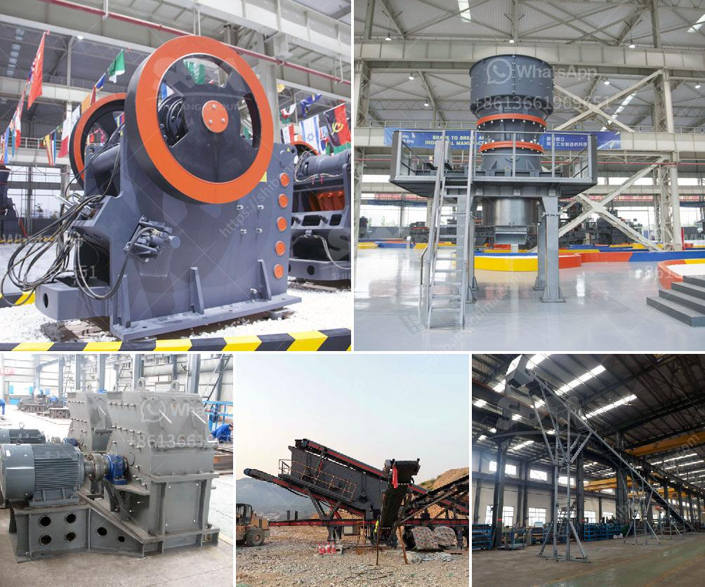

<h3>project cost estimation for iron ore pellet plant</h3>
Estimating the costs of a project is a critical process for ensuring its success. In the case of an iron ore pellet plant, it is essential to estimate the upfront investment, operational and maintenance costs, and potential revenues from the project. This article will provide an overview of the key factors to consider when estimating the cost of establishing such a plant.

The first step in estimating the project cost is to determine the scale of the plant. A smaller plant with a capacity of 100,000 metric tons per year will have a different cost structure compared to a larger facility with a capacity of 300,000 metric tons per year. The scale of the plant will affect various aspects, such as land acquisition, equipment and machinery requirements, and labor costs.

Land acquisition is an important factor to consider, as the plant will require a significant amount of space to operate efficiently. The cost of acquiring suitable land must be included in the project estimates. Additionally, environmental compliance and permits may be necessary, adding to the upfront expenses.

The cost of equipment and machinery is another significant consideration. This includes crushers, grinders, pelletizing equipment, conveyor systems, and other specialized machinery required for the process. Detailed cost analysis and obtaining quotes from suppliers will help estimate these expenses accurately.

Labor costs are a considerable component of the overall project cost. From plant operators to maintenance staff, technicians, and engineers, estimating salaries and benefits is crucial. These costs will vary based on the regional labor rates and the required skill levels.

Operational and maintenance costs should also be factored into the estimate. These costs include raw material procurement, energy consumption, maintenance and repairs, as well as insurance and other ongoing expenses. It is essential to forecast these costs over the project's lifespan to ensure adequate financial planning and resource allocation.

Finally, revenue projections will help assess the feasibility of the project. Market analysis and price forecasting for iron ore pellets will provide insights into potential revenues. Understanding the market demand, pricing dynamics, and competition will help estimate revenue streams realistically.

In conclusion, estimating the cost of establishing an iron ore pellet plant involves considering various factors such as land acquisition, equipment, labor, operational and maintenance costs, and revenue projections. It requires a detailed assessment of each element to provide an accurate estimate. By conducting a comprehensive cost analysis, project stakeholders can make informed decisions and secure the necessary funding for successful plant establishment and operation.
<h3>Contact us</h3><ul><li><strong>Whatsapp:&nbsp;<a href="https://wa.me/8613661969651">+8613661969651</a></strong></li><li><a href="https://swt.shibang-china.com/?git&amp;zhl&amp;project cost estimation for iron ore pellet plant"><strong>Online Service(chat now)</strong></a></li></ul><h3>Related</h3><ul><li><a href='quartz stone powder machinery manufacturing companies.md'>quartz stone powder machinery manufacturing companies</a></li><li><a href='slag grinding ball mill.md'>slag grinding ball mill</a></li><li><a href='trackmounted equipment.md'>track-mounted equipment</a></li><li><a href='belt conveyor design.md'>belt conveyor design</a></li><li><a href='jaw bone crusher made in britain.md'>jaw bone crusher made in britain</a></li></ul>