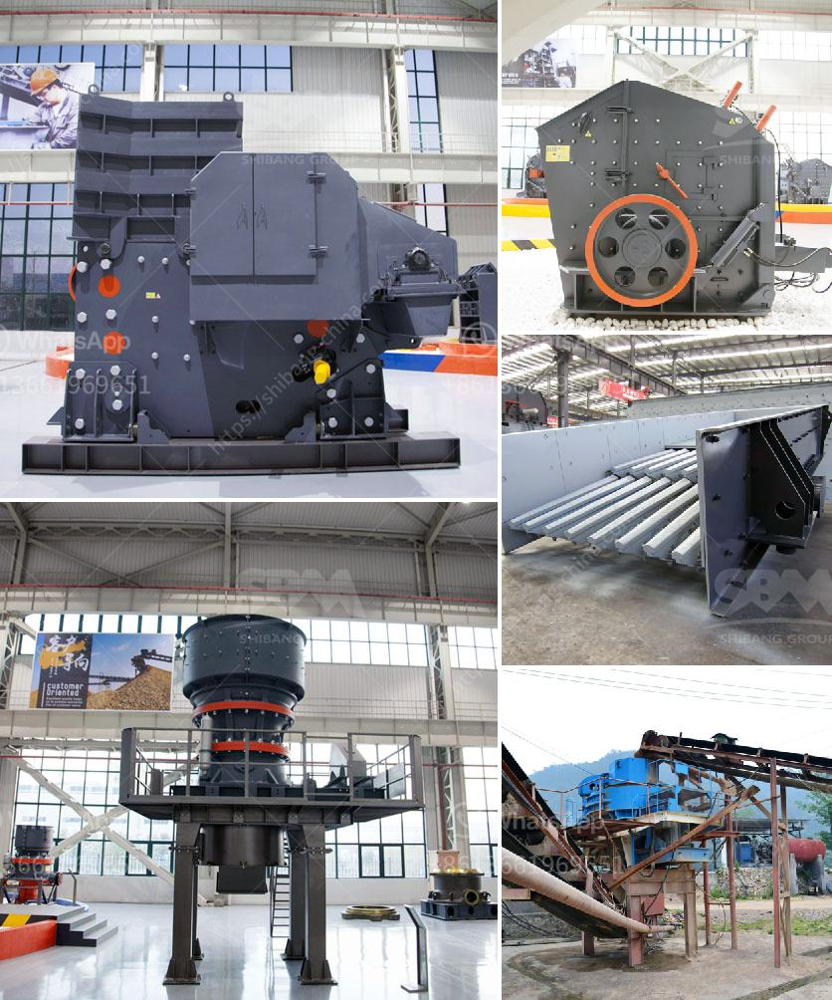

<h3>project cost of a cement plant</h3>
Building a cement plant is a significant undertaking, requiring careful planning, a comprehensive understanding of the construction process, and a clear vision for the final outcome. One of the key factors influencing the success and viability of such a project is the cost involved in setting up the plant. This article aims to shed light on the typical project cost of a cement plant, providing insights into the various components and considerations that contribute to this figure.

The cost of a cement plant can vary greatly depending on a multitude of factors, such as the location, size, and complexity of the project. To estimate the project's cost, a detailed feasibility study is typically conducted. This study examines various aspects of the project, including the raw materials required, plant design, machinery, infrastructure, and land acquisition.

The primary cost component of a cement plant is usually the machinery and equipment, which accounts for a significant portion of the total project cost. This includes essential equipment such as crushers, raw material mills, kilns, cement mills, and packing plants. The complexity and sophistication of these machines, as well as their capacity, will determine their price range. It is also important to consider factors such as delivery, installation, and commissioning costs, which can add to the overall expenditure.

Another crucial consideration is the cost associated with acquiring suitable land for the cement plant. This includes not only the purchase price but also expenses related to land preparation, site development, and infrastructure facilities. The availability and proximity of raw materials, such as limestone and gypsum, should also be taken into account as they may impact the transportation costs and overall viability of the project.

In addition to machinery and land costs, other elements to consider include labor, utilities, and administrative expenses. Labor costs are influenced by the required workforce, their skills, and prevailing wage rates in the region. Utilities, such as electricity and water supply, need to be factored in to ensure a smooth and uninterrupted operation. Administrative expenses cover various non-technical expenditures, such as permits, licenses, legal fees, insurance, and project management.

Furthermore, it is crucial to include contingency and escalation costs within the project budget. Contingency costs account for unforeseen events and unexpected expenses that may arise during construction, ensuring that the project remains financially viable. Escalation costs, on the other hand, reflect the potential increase in prices of materials or labor during the project timeline.

All these factors contribute to the final project cost, which can range from millions to even billions of dollars. It is necessary to note that every cement plant project is unique, and costs can vary depending on the specific requirements and circumstances. Therefore, conducting a thorough feasibility study, considering all the relevant factors, and seeking professional advice for accurate cost estimation is crucial.

In conclusion, the project cost of a cement plant encompasses multiple aspects, including machinery, land acquisition, labor, utilities, and administrative expenses. Conducting a detailed feasibility study and considering various elements will ensure a realistic estimation of the project cost. Understanding these cost components is crucial for successful project planning and execution, ensuring that the cement plant achieves its objectives and generates satisfactory returns on investment.
<h3>Contact us</h3><ul><li><strong>Whatsapp:&nbsp;<a href="https://wa.me/8613661969651">+8613661969651</a></strong></li><li><a href="https://swt.shibang-china.com/?git&amp;zhl&amp;project cost of a cement plant"><strong>Online Service(chat now)</strong></a></li></ul><h3>Related</h3><ul><li><a href='slag crusher machine project products.md'>slag crusher machine project products</a></li><li><a href='500 tph jaw crusher for sale.md'>500 tph jaw crusher for sale</a></li><li><a href='mobile stone crushing plants price.md'>mobile stone crushing plants price</a></li><li><a href='stone crushing production line.md'>stone crushing production line</a></li><li><a href='copper ore melting machines.md'>copper ore melting machines</a></li></ul>