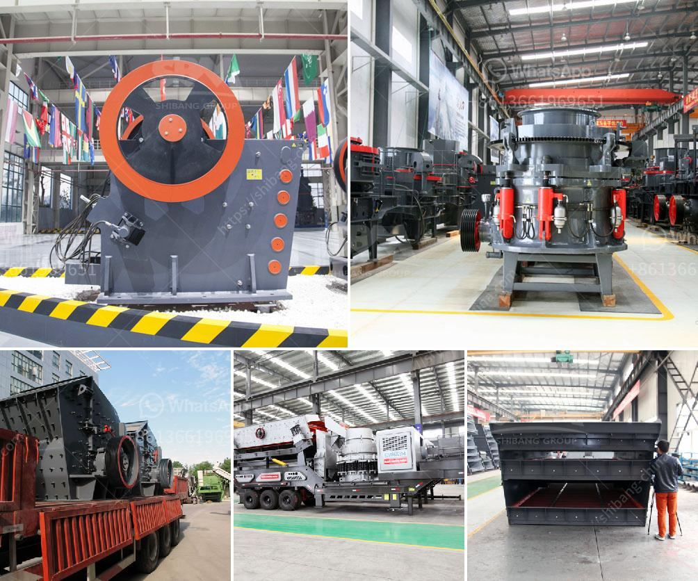

<h3>project on stone crushing unit</h3>
Stone crushing is a significant industrial sector in the region, engaging thousands of people in the production of crushed stones and quarrying of stones. For instance, in the hilly regions of the country, farmers and construction workers often depend on stone crushing units for their livelihood. However, the growing concerns over the environmental impact of these units have led to the initiation of a project aimed at mitigating these challenges.

The project focuses on establishing a stone crushing unit in the vicinity of the proposed area. This unit will produce gravel for construction purposes and other similar activities. The project aims to utilize the available natural resources efficiently and responsibly to minimize adverse environmental impacts.

One of the primary goals of this project is to assess the current environmental and social conditions of the area to ensure the sustainability of the stone crushing unit. Environmental impact assessments will be conducted to identify potential risks and develop appropriate mitigation measures. This includes monitoring air quality, noise levels, and water pollution, among others, to prevent and address any negative repercussions on the surroundings.

Furthermore, the project aims to promote sustainable practices within the stone crushing industry. This will be achieved by implementing eco-friendly technologies and best practices such as dust suppression systems, water recycling mechanisms, and efficient waste management techniques. Additionally, the project will focus on creating awareness among the local community about the importance of adopting sustainable methods in stone crushing operations.

The project also emphasizes the importance of social responsibility. It aims to provide employment opportunities to the local youth, especially those living in poverty. By creating jobs within the stone crushing unit, the project aspires to contribute to poverty reduction and enhance the socio-economic well-being of the community.

To ensure the successful implementation of the project, partnerships with relevant stakeholders are crucial. Engaging with local authorities, environmental agencies, and community leaders will aid in obtaining necessary permits, approvals, and support. Additionally, collaborations with organizations or institutions working on similar projects can provide valuable insights and knowledge-sharing opportunities.

The project team will continuously monitor and evaluate the progress of the stone crushing unit. Regular assessments will be conducted to measure the effectiveness of implemented measures and identify areas for improvement. This will help in maintaining the unit's compliance with environmental and social standards and ensure its sustainable operation in the long run.

In conclusion, the project on stone crushing units aims to establish a sustainable and responsible approach towards stone crushing activities. By promoting environmentally friendly practices and prioritizing social responsibility, the project seeks to mitigate the potential adverse impacts on the environment and communities. Through collaborative partnerships and continuous monitoring, the project aspires to contribute positively to the region's development and overall well-being.
<h3>Contact us</h3><ul><li><strong>Whatsapp:&nbsp;<a href="https://wa.me/8613661969651">+8613661969651</a></strong></li><li><a href="https://swt.shibang-china.com/?git&amp;zhl&amp;project on stone crushing unit"><strong>Online Service(chat now)</strong></a></li></ul><h3>Related</h3><ul><li><a href='japan crushing machine manufacturers list.md'>japan crushing machine manufacturers list</a></li><li><a href='alluvial gold mining machines.md'>alluvial gold mining machines</a></li><li><a href='quarry crusher machine.md'>quarry crusher machine</a></li><li><a href='alluvial gold mining in zimbabwe.md'>alluvial gold mining in zimbabwe</a></li><li><a href='sample of gold mining business plan in ghana.md'>sample of gold mining business plan in ghana</a></li></ul>