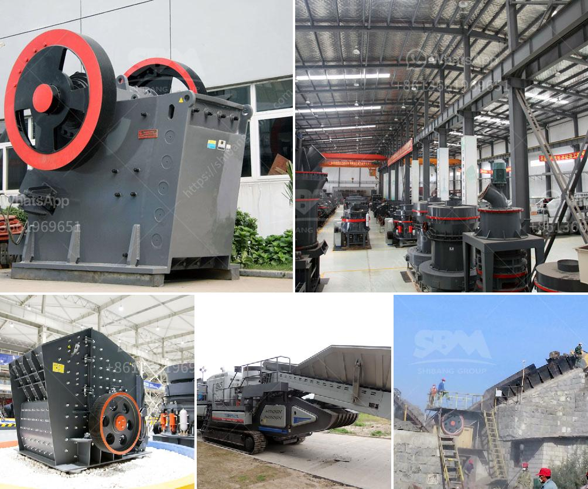

<h3>project report on mini kaolin mining</h3>
Kaolin is a type of clay mineral found in abundance around the world. It is commonly used in various industries such as ceramics, paper, pharmaceuticals, cosmetics, and more. With its versatility and wide range of applications, there is a growing demand for kaolin. This article presents a project report on mini kaolin mining, focusing on the extraction and production of kaolin on a smaller scale.

The objective of this project is to establish a mini kaolin mining operation that can cater to the local market. Unlike large-scale mining operations, which require significant investments and extensive infrastructure, this project aims to maximize local resources and utilize cost-effective extraction methods.

The first step in the project is to conduct a thorough feasibility study. This includes assessing the availability and quality of kaolin deposits in the area, analyzing market demand and potential customers, and evaluating the economic viability of the project. The study will determine the viability of establishing a mini kaolin mining operation and outline the necessary steps for its implementation.

Once the feasibility study is completed and the project is deemed viable, the next step is to secure the required permits and licenses. This involves navigating through the legal requirements and regulations governing mining activities in the region. It is crucial to obtain all the necessary approvals to ensure the project operates in compliance with environmental and safety standards.

After obtaining the necessary permits, the project can commence with the actual mining operations. The extraction of kaolin typically involves surface mining methods such as open-pit mining or quarrying. These methods are suitable for mini operations as they require less capital investment and can be easily controlled.

Once the kaolin is extracted, it goes through a series of processes to separate impurities and obtain a high-quality product. These processes include crushing, grinding, and washing. The crushed material is then mixed with water to form a slurry, which is further refined through sedimentation and filtration. The final product is dried and packaged for distribution to customers.

One key aspect of this mini kaolin mining project is its minimal environmental impact. By using surface mining methods and employing best practices for waste management and land reclamation, the project aims to ensure sustainability and minimize disturbance to the surrounding environment.

Another critical aspect of the project is its contribution to the local economy. Mini mining operations can create employment opportunities for the local community, generate revenue through taxes and royalties, and stimulate economic growth. Moreover, by supplying locally sourced kaolin, the project aims to reduce dependence on imported kaolin and enhance the self-sufficiency of the region.

In conclusion, this project report outlines the steps involved in establishing a mini kaolin mining operation. By conducting a feasibility study, securing permits, and implementing cost-effective extraction methods, the project aims to meet the local demand for high-quality kaolin. With a focus on environmental sustainability and economic development, this mini kaolin mining project can be a valuable asset to the local community and contribute to the growth of the industry.
<h3>Contact us</h3><ul><li><strong>Whatsapp:&nbsp;<a href="https://wa.me/8613661969651">+8613661969651</a></strong></li><li><a href="https://swt.shibang-china.com/?git&amp;zhl&amp;project report on mini kaolin mining"><strong>Online Service(chat now)</strong></a></li></ul><h3>Related</h3><ul><li><a href='limestone powder making machine india.md'>limestone powder making machine india</a></li><li><a href='aggregate concrete plant.md'>aggregate concrete plant</a></li><li><a href='used 900 cone crusher for sale.md'>used 900 cone crusher for sale</a></li><li><a href='second hand german jaw crusher for sale.md'>second hand german jaw crusher for sale</a></li><li><a href='gypsum making machine.md'>gypsum making machine</a></li></ul>