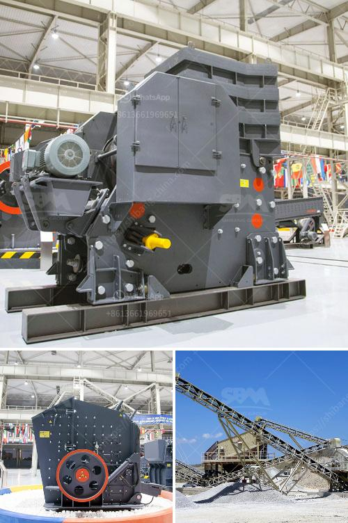

<h3>pulverizer crusher machine for coal</h3>
The pulverized coal produced by pulverizer crusher machines is ideal for use in the industrial sector. Consistently pulverized coal has sustainable benefits such as enhanced combustion efficiency, improved power output and reduced emissions of pollutants. Pulverizer crusher machines crush coal into fine powders for thermal power plant production lines.

In coal-fired power plants, the first process is coal crushing. The coal is then transported to the pulverizer, which grinds the coal into fine powder and transforms it into raw ash. The raw ash is then collected in the ash collection equipment for further combustion or disposal.

The pulverizer crusher machines are ideal for processing non-explosive, non-flammable, hard and brittle ores such as limestone, granite, gypsum, clay, basalt, iron ore, coal and so on. The pulverizer crusher machine is widely used in construction, mining, metallurgy, energy, transportation, heating and other industries.

The crusher machine is mainly composed of motor, driving system, main shaft, rotor, and water-cooling system. The motor drives the main shaft to rotate, and the rotor wobbles hammers mounted on the rotor. Crushed coal particles are ejected out of the grinding chamber through the screen hole and then discharged from the outlet.

The screens of the pulverizer crusher machines are woven mesh, perforated, or punch hole screens. These screens can be used to separate the materials based on their sizes and shapes. The type of screen is selected based on the application requirements and the desired particle size of the pulverized coal.

The pulverizer crusher machines are designed with high-speed rotation hammers that can crush coal with a maximum size of 25mm. It forms a complete set of crushing machines with the belt conveyor for feeding and the vibrating screen for screening.

Crushed coal can be directly used as fuel for thermal power plants. Preheating equipment is usually installed in the system to ensure the safe and efficient combustion of coal. Pulverized coal particles are used to increase the efficiency of the boiler and reduce operating costs.

In addition to thermal power plants, pulverized coal can also be used for metallurgical, chemical, cement, and other industries. Pulverized coal is often injected into the blast furnace to improve the combustion efficiency and reduce the amount of coke required.

The pulverizer crusher machine is an ideal choice for coal-fired power plants, pulverized coal boiler manufacturing, and coal dust injection into the kiln. With this device, coal can be crushed to a certain fineness, which can make full use of coal resources, increase heat utilization rate, reduce emissions of harmful substances, and realize efficient utilization of coal.

In conclusion, the pulverizer crusher machine for coal produces pulverized coal ideal for use in the industrial sector. It significantly improves combustion efficiency, power output, and reduces emissions of pollutants. By using pulverized coal, industries can achieve sustainable benefits while efficiently utilizing coal resources.
<h3>Contact us</h3><ul><li><strong>Whatsapp:&nbsp;<a href="https://wa.me/8613661969651">+8613661969651</a></strong></li><li><a href="https://swt.shibang-china.com/?git&amp;zhl&amp;pulverizer crusher machine for coal"><strong>Online Service(chat now)</strong></a></li></ul><h3>Related</h3><ul><li><a href='milling equipment ball mill.md'>milling equipment ball mill</a></li><li><a href='how much does a crusher.md'>how much does a crusher</a></li><li><a href='ball mill for starch damage.md'>ball mill for starch damage</a></li><li><a href='vibrating screen made in the philippines.md'>vibrating screen made in the philippines</a></li><li><a href='hammer mill for 200 mesh powder.md'>hammer mill for 200 mesh powder</a></li></ul>