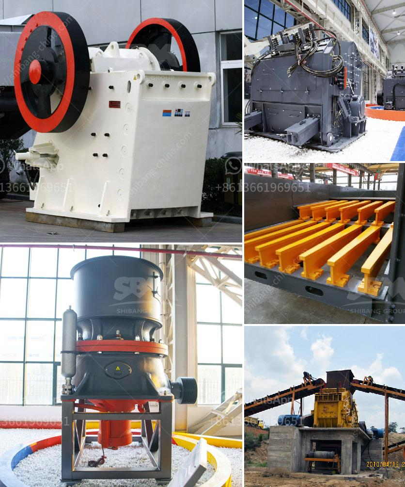

<h3>pulverizer crusher manufacturer in rajkot india</h3>
The population boom and rapid urbanization in developing nations across the world have led to increased demand for construction materials and building aggregates. As a result, the construction industry is thriving, contributing significantly to a country's economy. In India, one of the leading countries in construction development, the demand for construction materials, including sand, gravel, and stones, has skyrocketed in recent years. 

To meet this growing demand, several manufacturers have emerged in the market, offering various types of equipment and machinery to aid in the production of construction materials. Among these manufacturers, pulverizer crusher manufacturers in Rajkot, India, have gained widespread popularity due to their efficient and effective machinery.

Pulverizer crushers are designed to crush and grind various types of materials into fine particles. The pulverizing process crushes the material into small, granular sizes, making it suitable for use in construction applications. These crushers are commonly used in the mining industry, where ore needs to be reduced to smaller sizes before it can be processed further.

One of the leading pulverizer crusher manufacturers in Rajkot, India, is Krishna Industries. With over three decades of experience in the industry, Krishna Industries has established a solid reputation for delivering high-quality pulverizer crushers to its clients.

Krishna Industries offers a wide range of pulverizer crushers, catering to different needs and requirements of its customers. The company's crushers are known for their durability, efficiency, and low maintenance requirements. They are designed to handle various types of materials, including limestone, granite, sandstone, and more.

The manufacturing facility of Krishna Industries is equipped with state-of-the-art machinery and advanced technology. The company's team of skilled technicians and engineers ensures that each crusher is manufactured to meet the highest quality standards. Stringent quality checks are conducted at every stage of the manufacturing process to ensure that only the best products are delivered to the clients.

In addition to its high-quality products, Krishna Industries also provides excellent after-sales service. The company has a dedicated customer support team that is always ready to assist clients with any queries or concerns. This commitment to customer satisfaction has helped Krishna Industries build long-lasting relationships with its clients, making it one of the most trusted pulverizer crusher manufacturers in Rajkot, India.

The demand for pulverizer crushers in the construction industry is expected to continue growing in the coming years. With the government's focus on infrastructure development and the increasing number of construction projects, the need for quality construction materials will only rise. Pulverizer crusher manufacturers, like Krishna Industries, are poised to benefit from this market expansion.

In conclusion, the pulverizer crusher manufacturing industry in Rajkot, India, is witnessing significant growth due to the rising demand for construction materials. Manufacturers like Krishna Industries are playing a vital role in meeting this demand by offering high-quality pulverizer crushers. With their focus on quality, customer satisfaction, and advanced technology, these manufacturers are poised for success in the booming Indian construction industry.
<h3>Contact us</h3><ul><li><strong>Whatsapp:&nbsp;<a href="https://wa.me/8613661969651">+8613661969651</a></strong></li><li><a href="https://swt.shibang-china.com/?git&amp;zhl&amp;pulverizer crusher manufacturer in rajkot india"><strong>Online Service(chat now)</strong></a></li></ul><h3>Related</h3><ul><li><a href='mobile copper concentrate machine.md'>mobile copper concentrate machine</a></li><li><a href='price of mobile crusher.md'>price of mobile crusher</a></li><li><a href='equipments of copper processing.md'>equipments of copper processing</a></li><li><a href='stone crusher plant layout.md'>stone crusher plant layout</a></li><li><a href='mobile crusher in codelco.md'>mobile crusher in codelco</a></li></ul>