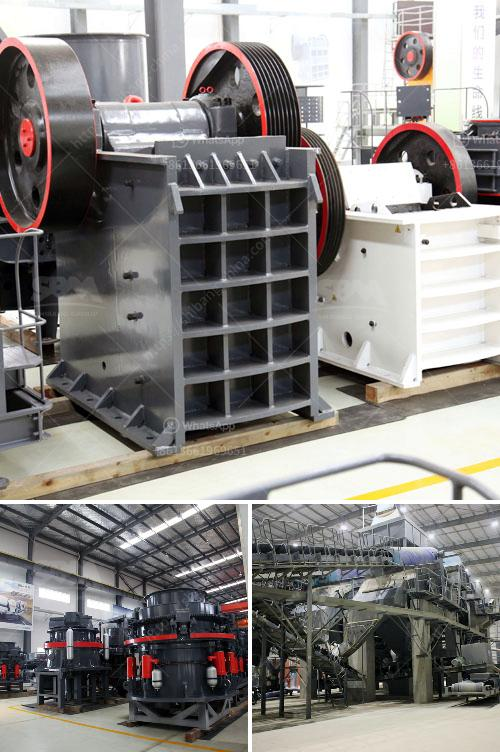

<h3>pulverizer machine for grinding of calcium powder</h3>
A pulverizer machine is used for grinding calcium powder to ensure smooth operations in various industrial sectors. Calcium carbonate powder is an essential ingredient in many industries such as agriculture, construction, food, and pharmaceuticals. It is used as an additive, filler, and coating agent, making it an indispensable material for a wide range of applications.

The pulverizer machine for grinding calcium powder adopts advanced technology and is suitable for processing various non-flammable and explosive mineral materials with Mohs hardness below 9.3 and humidity below 6%. It is widely used in the fields of metallurgy, construction, chemical industry, mining, highway construction, etc.

One of the key benefits of using a pulverizer machine for grinding calcium powder is its high grinding efficiency. The machine is equipped with a high-speed rotating disc, which enables the grinding material to be ground by the impact and friction between the grinding disc and the material. The fineness of the finished calcium powder can be adjusted by changing the speed of the grinding disc, ensuring that the desired particle size is achieved.

Another advantage of using a pulverizer machine for grinding calcium powder is its excellent performance in terms of energy consumption. The machine is designed to be energy-efficient, reducing the overall energy consumption during the grinding process. This not only helps in cost savings but also contributes to environmental sustainability.

Moreover, the pulverizer machine for grinding calcium powder is easy to operate and maintain. It is equipped with a user-friendly control panel that allows operators to adjust the grinding parameters and monitor the grinding process in real-time. The machine is designed with safety features to ensure the safety of the operators during operation.

In conclusion, a pulverizer machine for grinding calcium powder is a valuable tool in various industries. Its high grinding efficiency, energy-saving performance, and ease of operation make it an ideal choice for grinding calcium powder. Investing in a reliable pulverizer machine not only enhances the production process but also improves product quality, resulting in increased profitability for businesses.
<h3>Contact us</h3><ul><li><strong>Whatsapp:&nbsp;<a href="https://wa.me/8613661969651">+8613661969651</a></strong></li><li><a href="https://swt.shibang-china.com/?git&amp;zhl&amp;pulverizer machine for grinding of calcium powder"><strong>Online Service(chat now)</strong></a></li></ul><h3>Related</h3><ul><li><a href='quartz manufacturing plant in tamilnadu.md'>quartz manufacturing plant in tamilnadu</a></li><li><a href='silica sand grinding machine.md'>silica sand grinding machine</a></li><li><a href='small quarry crusher for sale.md'>small quarry crusher for sale</a></li><li><a href='ball mill outpot capicity 180 tph.md'>ball mill outpot capicity 180 tph</a></li><li><a href='used sand screening equipment for sale.md'>used sand screening equipment for sale</a></li></ul>