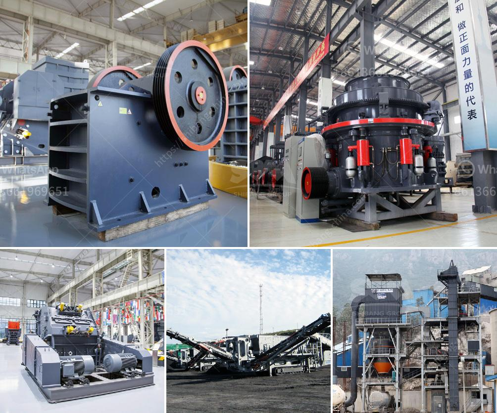

<h3>pulverizer raymond mill</h3>
The pulverizer Raymond mill is a grinding machine that is widely used in the mining, construction, metallurgical and chemical industries. It is designed to grind various non-flammable and non-explosive mineral materials with Moh's hardness below 9.3 and humidity below 6%. This machine is ideal for processing quartz, feldspar, limestone, calcite, gypsum, dolomite, barite, talc, coal, calcium carbonate, slag, iron ore, gold ore, etc.

One of the key features of the pulverizer Raymond mill is its advanced structure. It has a vertical structure with a small footprint and strong systematicness. It can be a complete production system from raw material crushing to product packaging. The main parts of the mill are made of high-quality steel and alloy materials, which ensure its durability and long service life. The electrical system of the Raymond mill is controlled centrally, and the grinding workshop can be basically unmanned operation.

Another important feature of the pulverizer Raymond mill is its high efficiency and energy saving. Compared with other grinding equipment, the Raymond mill has a higher output and lower power consumption. Under the same grinding conditions, the production capacity is 20%-30% higher than that of other mills, and the energy consumption is reduced by about 30%. The high-efficiency impeller-type energy-saving fan is used, which improves the efficiency of the powder selection and saves power consumption by 25% to 30% compared with the blade-type energy-saving fan.

The pulverizer Raymond mill is also equipped with an automatic control system, which can achieve remote start and stop, monitoring of the production process, and easy maintenance. The grinding roller adopts a new type of sealing device, which effectively avoids the problems of dust pollution and lubrication failure, ensuring the reliable operation of the equipment. The grinding roller and grinding ring are made of special wear-resistant steel, which has a longer service life and reduce the consumption of wearing parts.

In addition, the pulverizer Raymond mill is easy to adjust the fineness of the finished product. The size of the finished product can be adjusted between 30-400 mesh, which can meet the requirements of different industries. The analyzer of the Raymond mill adopts a high-density blade rotor, which can ensure a good classification effect and improve the quality of the finished product.

In conclusion, the pulverizer Raymond mill is a versatile and efficient grinding machine that is widely used in the mining, construction, metallurgical, and chemical industries. Its advanced structure, high efficiency, energy-saving, easy operation, and adjustment, as well as its ability to grind various materials, make it an essential equipment in these industries. As technology continues to advance, the Raymond mill will continuously improve and develop, bringing more benefits to its users.
<h3>Contact us</h3><ul><li><strong>Whatsapp:&nbsp;<a href="https://wa.me/8613661969651">+8613661969651</a></strong></li><li><a href="https://swt.shibang-china.com/?git&amp;zhl&amp;pulverizer raymond mill"><strong>Online Service(chat now)</strong></a></li></ul><h3>Related</h3><ul><li><a href='gold processing machinery in china.md'>gold processing machinery in china</a></li><li><a href='kaolin powder machine.md'>kaolin powder machine</a></li><li><a href='spare parts for raymond mill.md'>spare parts for raymond mill</a></li><li><a href='ball mill in turkey.md'>ball mill in turkey</a></li><li><a href='stone crusher made in greece.md'>stone crusher made in greece</a></li></ul>