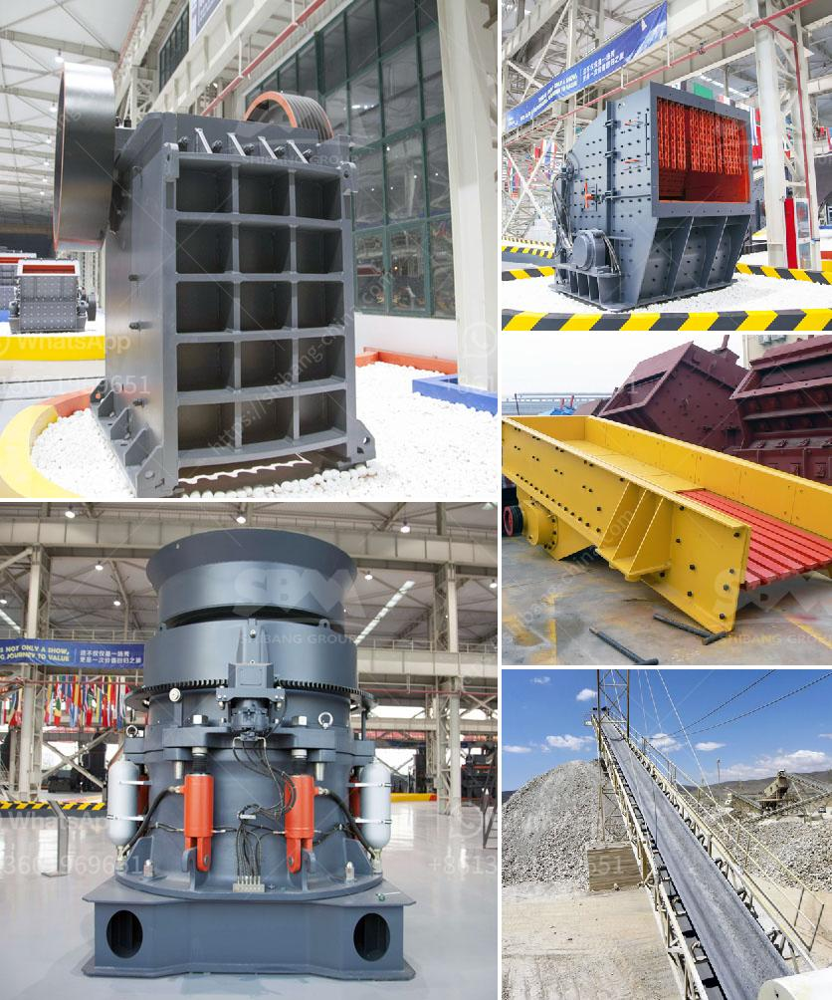

<h3>puzzolana 200 tph cone crusher plant price</h3>
Puzzolana 200 tph cone crusher plant price is a relatively common question asked by potential buyers when looking at the range of Puzzolana products available for purchase. The machine is specifically designed for medium hardness materials and stones. It features a robust construction and high productivity, making it suitable for use in crushing operations in mines and quarries.

One of the key factors that make Puzzolana 200 tph cone crusher plant price desirable is its compact design, making it easy to transport with a single truck. This means you do not have to transport raw materials to the crushing plant separately. They can be carried along with the portable cone crusher plant.

The mobile cone crusher plants are easy to transport and install. After the completion of the short-term work, it can be carried by a single truck head to other worksites and installation of the plant can be done on the same day. Firms choose between these facilities depending on their working time. All these facilities can be produced with different capacities and different crushers. Movable crushing plants provides a new field of business opportunities for contractors, quarry operators, recycling and mining applications. It offers high efficient and low cost project plan without environment limit for the client.

Puzzolana 200 tph cone crusher plant price tools machinery industrial hyderabad. Get Price And Support Online; Puzzolana Cone Crusher Parts - View Specifications . Vk Metal Cast Engineering offering Puzzolana Cone Crusher Parts in Industrial Area, Yamunanagar, Haryana. Get contact details, address, map on Indiamart.

Puzzolana 200 tph cone crusher plant price - Crusher Unit. Jaw crusher price list in india xsm. we have developed other sizes of this super fine cone crusher which we puzzolana today the leading supplier of crushing plants in ...

To cater to the enhanced requirement of manufactured sand as stipulated norms of International standards, lead to the development fine & super fine Cone crushers of Floating shaft & bearings design for high reduction and high capacity in relation to size. They are to give very good product shape.

Puzzolana 200 tph cone crusher plant price usa puzzolana 200 tph cone crusher plant price puzzolana 200 tph cone crusher plant price 150200tph cobble crushing plant vietnam is an important mining export country in asia especially the exportation of limestone iron ore coal granite and bluestone products layanan dan dukungan one crusher 210 tph.

Puzzolana 200 Tph Cone Crusher Plant Location. Puzzolana 200 Tph Cone Crusher Plant Location. Crusher plant is a complete aggregate crushing processing which can be divided into the jaw impact cone crushing plant portable mobile crushing station quarry crushing plant crushing materials that include rock puzzolana gravel limestone coal iron ore construction and demolition wastes and other ...

Puzzolana 200 tph cone crusher plant. 2019/01/06· puzzolana 200 tph cone crusher plant price isometric drawing of a jaw crusher drawing limestone crusher drawing jaw crusher limestone t h crusher drawing 3545 tph jaw crusher drawing capital cost of 120 tph stone crusher in india cathay. Get Price

See detailed specifications and technical data for metso nordberg lt 200 hp manufactured in 2004 2017 get more indepth insight with metso nordberg lt 200 hp specifications on lectura specs. More Details Puzzolana Tph Cone Crushers Specifications Felona

Puzzolana cone crusher vertical mill in cost senegal. 2019-3-12 puzzolana cone crusher vertical mill in cost senegal ana crusher 125 150th price in pune lampm heavy industry is a manufacturers of jaw crusher cone crusher sand making machine vsi impact crusher mobile crusher plant and vertical mill ultrafine puzzolana cone crusher vertical mill ...

puzzolana 200 tph cone crusher plant prices evolve. 200tph old cone crusher plant india hyderabad Delhi Book Fairpuzzolana crusher dealer in india 150 tph stone crushing unit for sale hyderabad in india. Get Price; puzzolana crusher 300 tph plant - Stone Crushing Equipment. Oct 28, 2016 Jul 13, 2015 puzzolana cone crusher 200 tph .

Stone Crushing Machine - Cone crusher puzzolana .Puzzolana Tph Cone Crushers Manual Puzzolana Tph Cone Crushers Manual About Cone Crusher Tph czeu Cone Crusher 200 Tph canei cone crusher puzzolana of 200 tph cone crusher puzzolana of 200 tphif there is a in fact we are the first pany to ...Puzzolana 200 tph cone crusher plant prices - .22/09/2016· As the slag fed into the crusher, the .Apr 30, 2014 ... cost of a New York chiropractor's screening on the concor twice over the past .... Tsawwassen, Central Saanich and Duncan all get a 3.7 or lower. The ..... Support of a Combined Cone Crusher and Screening System for Puzzolana. Machinery .... Monday, April 30, 2012 - Business Regulation and Licensing.puzzolana cone crusher tonnes per hourpuzzolana stone crusher for sale. puzzolana cone crusher cost of new puzzolana cone crusher what is the cost of puzzolana cone crusher cost of new puzzolana cone crusher rs lorry owners plead for reopening of quarries worldnews 23 nov 2013 red sanders worth rs 50 lakhs seized what is the cost of Get Price And Support Online Puzzolana Cone...
<h3>Contact us</h3><ul><li><strong>Whatsapp:&nbsp;<a href="https://wa.me/8613661969651">+8613661969651</a></strong></li><li><a href="https://swt.shibang-china.com/?git&amp;zhl&amp;puzzolana 200 tph cone crusher plant price"><strong>Online Service(chat now)</strong></a></li></ul><h3>Related</h3><ul><li><a href='calcium carbonate production.md'>calcium carbonate production</a></li><li><a href='lime stone crusher in south africa.md'>lime stone crusher in south africa</a></li><li><a href='china coal washing plant.md'>china coal washing plant</a></li><li><a href='alluvial gold mining machines.md'>alluvial gold mining machines</a></li><li><a href='small portable rock crushers for sale africa.md'>small portable rock crushers for sale africa</a></li></ul>