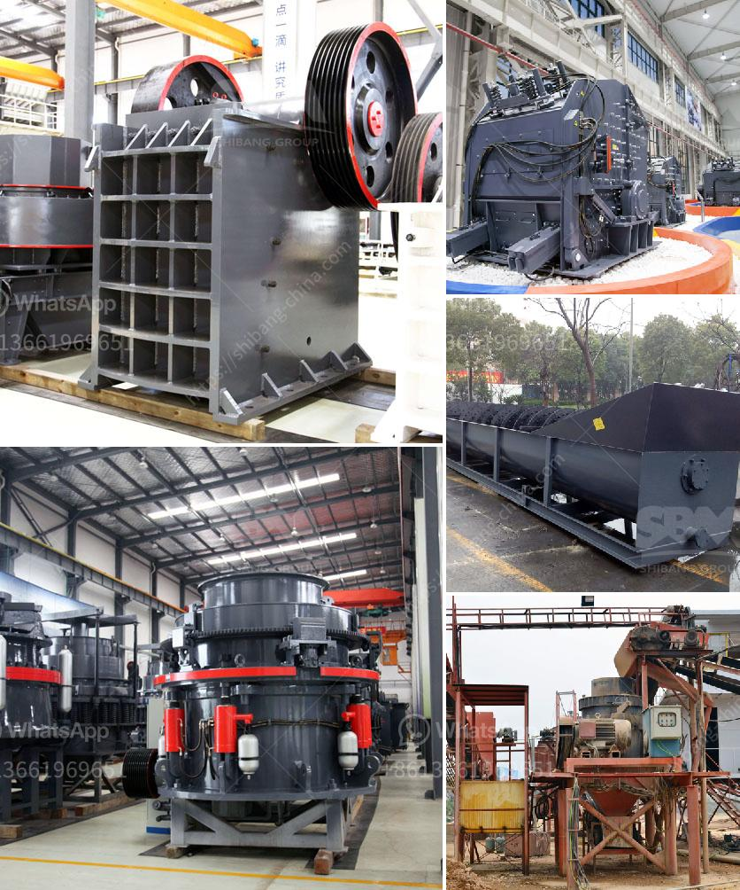

<h3>quarry crusher factors</h3>
In the world of quarrying, there are many factors to consider when looking to invest in a new crushing machine. Our focus today is on the quarry crusher factors that can determine the success of your operation.

First and foremost, let's tackle the importance of choosing the right type of crusher for your specific needs. There are various types of crushers available on the market, such as jaw crushers, impact crushers, cone crushers, and more. Each type has its own specific advantages and disadvantages, which need to be carefully evaluated before making a decision.

One important factor to consider is the material you will be crushing. Different materials have different characteristics, and not all crushers are suitable for all materials. For example, a jaw crusher might be ideal for crushing softer materials like limestone, while a cone crusher would be more suitable for crushing harder materials like granite or basalt. Understanding the properties of your material is crucial in determining the right crusher for your quarry.

The size and capacity of the crusher are crucial factors as well. The size refers to the dimensions of the crusher's feed opening, while the capacity is the maximum amount of material that the crusher can process in a given time period. It's important to choose a crusher that can handle your desired capacity and can easily accommodate the size of the material you will be feeding into it.

Furthermore, the efficiency of the crusher is a critical aspect to consider. This is often measured by the reduction ratio, which indicates the amount of reduction that the crusher can achieve in a single pass. The greater the reduction ratio, the more efficient the crusher will be at reducing the size of the material.

Another quarry crusher factor to consider is the maintenance requirements of the machine. Regular maintenance is essential to ensure the crusher operates at its best and extends its lifespan. Some crushers require more frequent maintenance than others, so it's important to take these factors into account when choosing the right crusher for your quarry.

Lastly, the cost of the crusher is a crucial factor to consider. Budget constraints will inevitably play a role in your decision-making process. It's important to strike a balance between cost and performance, ensuring that you invest in a crusher that meets your requirements without breaking the bank.

In conclusion, understanding the various quarry crusher factors is essential in ensuring the success of your quarrying operation. Choosing the right type of crusher, considering the material, size, capacity, efficiency, maintenance requirements, and cost are all crucial elements to keep in mind. By taking the time to evaluate these factors, you can make an informed decision and invest in a crusher that will help you achieve your quarrying goals.
<h3>Contact us</h3><ul><li><strong>Whatsapp:&nbsp;<a href="https://wa.me/8613661969651">+8613661969651</a></strong></li><li><a href="https://swt.shibang-china.com/?git&amp;zhl&amp;quarry crusher factors"><strong>Online Service(chat now)</strong></a></li></ul><h3>Related</h3><ul><li><a href='15 tph cement grinding unit.md'>15 tph cement grinding unit</a></li><li><a href='mobile crushers philippines.md'>mobile crushers philippines</a></li><li><a href='transmission for ball mill.md'>transmission for ball mill</a></li><li><a href='puzzolana 200 tph cone crusher plant price.md'>puzzolana 200 tph cone crusher plant price</a></li><li><a href='the roller grinding mill.md'>the roller grinding mill</a></li></ul>