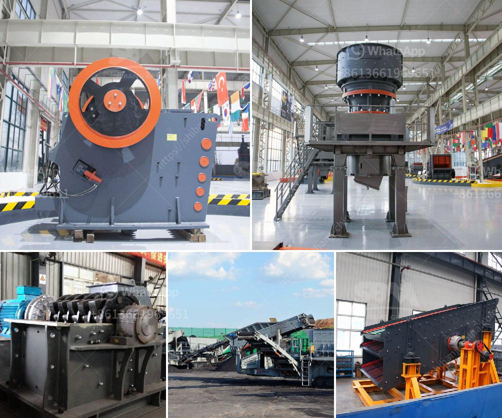

<h3>quarry crusher for sale in ghana</h3>
Ghana, known for its immense natural resources, is continuously experiencing growth and development in several sectors, including the quarry and mining industry. The demand for crushed stones, gravels, and other construction materials is skyrocketing, making it a lucrative business opportunity. To meet this demand, a quarry crusher is essential.

A quarry crusher is a machine used to break stones into smaller sizes for construction purposes. Crushers such as jaw crushers, impact crushers, and cone crushers are commonly used in the quarrying industry to crush materials into smaller pieces. These machines are invaluable tools in mining and construction as they efficiently crush materials, reducing them to the desired size for various applications.

Investing in a quarry crusher for sale in Ghana is an excellent opportunity for entrepreneurs. With the country's increasing construction projects and the high demand for building materials, investing in a quarry crusher is a profitable venture. Here are a few reasons why:

1. Growing construction industry: Ghana's construction industry is booming due to infrastructure development projects such as roads, bridges, and buildings. This creates a huge demand for crushed stones and aggregates, which can be met with a quarry crusher.

2. Low maintenance and operational costs: Quarry crushers are designed to be sturdy and durable, requiring minimal maintenance. They are built to withstand harsh working conditions, making them cost-effective in the long run.

3. Easy availability of raw materials: Ghana is rich in natural resources, making it easier to source raw materials for the quarry crusher. This reduces transportation costs and increases profitability.

4. High return on investment: Investing in a quarry crusher offers a high return on investment. As the demand for construction materials increases, so does the demand for crushed stones, gravels, and aggregates. This ensures a steady stream of income and potential for expansion.

5. Contribution to sustainable development: Quarrying activities, when done responsibly, can contribute to sustainable development. Proper management of resources, adherence to environmental regulations, and job creation benefit the local community and the country as a whole.

In conclusion, a quarry crusher for sale in Ghana is a must-have investment for entrepreneurs in the construction and mining industry. The high demand for construction materials, coupled with the country's rich resources, makes it an excellent business opportunity. With low maintenance costs and high returns, investing in a quarry crusher can lead to long-term success while contributing to sustainable development.
<h3>Contact us</h3><ul><li><strong>Whatsapp:&nbsp;<a href="https://wa.me/8613661969651">+8613661969651</a></strong></li><li><a href="https://swt.shibang-china.com/?git&amp;zhl&amp;quarry crusher for sale in ghana"><strong>Online Service(chat now)</strong></a></li></ul><h3>Related</h3><ul><li><a href='marble crusher for sale.md'>marble crusher for sale</a></li><li><a href='silica sand crusher in turkey.md'>silica sand crusher in turkey</a></li><li><a href='calcium oxide crusher.md'>calcium oxide crusher</a></li><li><a href='7 in x 8 in hammer mill gold quarz.md'>7 in x 8 in hammer mill gold quarz</a></li><li><a href='drawing for sand washing machines crusher mill.md'>drawing for sand washing machines crusher mill</a></li></ul>