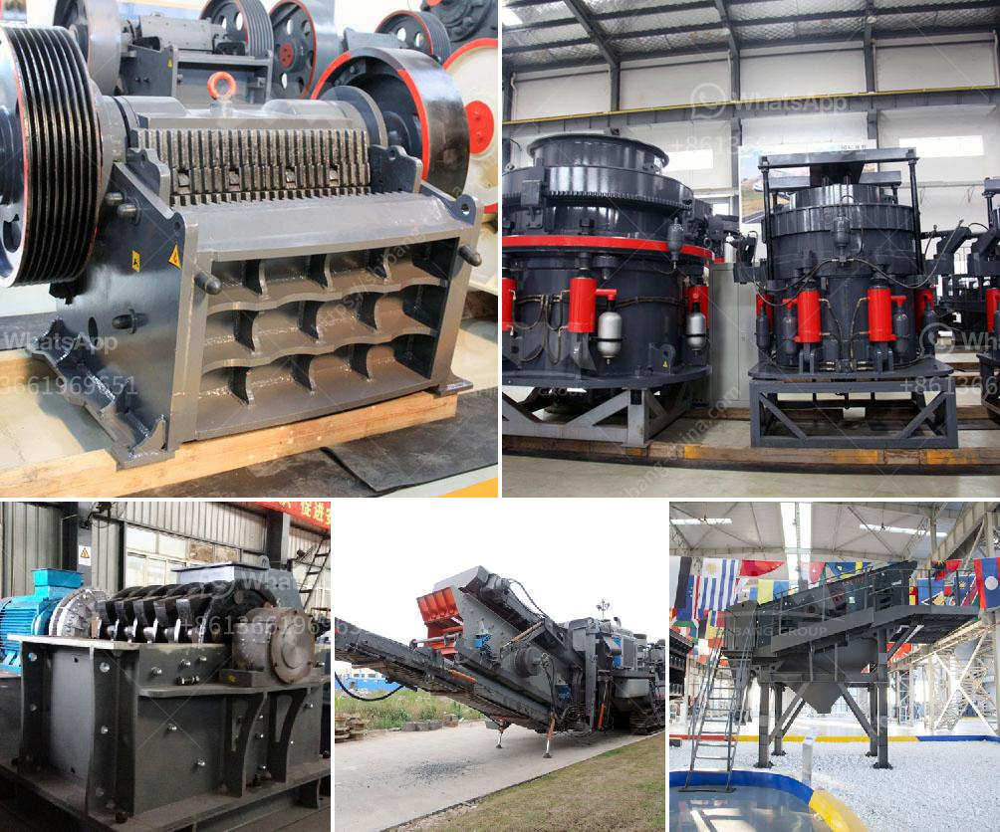

<h3>quarry crusher for sale in ibadan</h3>
Ibadan, known as the largest city in Nigeria and the second in Africa, is a bustling and vibrant city with a population that surpasses 3 million residents. As the economic center of Nigeria, Ibadan houses several industries and businesses, one of which is the stone crushing industry. Stone crushing has been a major part of Ibadan's thriving industrial activities for decades, providing essential construction materials for the city and its environs.

Quarry crushers play a pivotal role in enhancing stone crushing efficiency. These devices are used to break large chunks of stones or rocks into smaller pieces that can be used for construction purposes. Crushing stones manually has become outdated, as technology has advanced to provide more efficient and effective ways of achieving stone crushing. Quarry crushers are designed to crush stones and rocks into smaller sizes, which can be used as raw materials for construction projects, such as houses, bridges, roads, and other infrastructural developments, which are vital for Ibadan's growth.

For those seeking to invest in the stone crushing business in Ibadan, quarry crushers for sale are readily available to meet the demands of various crushing needs. These crushers come in different sizes and specifications, suitable for both small and large-scale operations. They are designed to crush stones and rocks efficiently to produce consistent and quality construction materials, thereby eliminating the need for manual stone crushing. This not only saves time, but also enhances productivity.

Investing in a quarry crusher for sale in Ibadan can be a lucrative venture, as the demand for crushed stones and rocks continues to rise. With an increasing population in Ibadan and the need for more infrastructural developments, the market for construction materials is ever-expanding. A quarry crusher ensures that stones and rocks are crushed to the required specifications for construction, providing a steady supply of materials for various projects.

In conclusion, quarry crushers for sale in Ibadan offer a solution to the increasing demand for crushed stones and rocks for construction purposes. These crushers are designed to produce high-quality materials efficiently, thereby enhancing stone crushing efficiency in Ibadan. Investing in these crushers presents an opportunity for entrepreneurs to contribute to the growth and development of Ibadan's construction industry while also reaping the rewards of a profitable business venture.
<h3>Contact us</h3><ul><li><strong>Whatsapp:&nbsp;<a href="https://wa.me/8613661969651">+8613661969651</a></strong></li><li><a href="https://swt.shibang-china.com/?git&amp;zhl&amp;quarry crusher for sale in ibadan"><strong>Online Service(chat now)</strong></a></li></ul><h3>Related</h3><ul><li><a href='mobile crusher tanzania.md'>mobile crusher tanzania</a></li><li><a href='used stone crusher mini plant india.md'>used stone crusher mini plant india</a></li><li><a href='automatic stone crusher plant.md'>automatic stone crusher plant</a></li><li><a href='gypsum stone crusher.md'>gypsum stone crusher</a></li><li><a href='ball mill india india.md'>ball mill india india</a></li></ul>