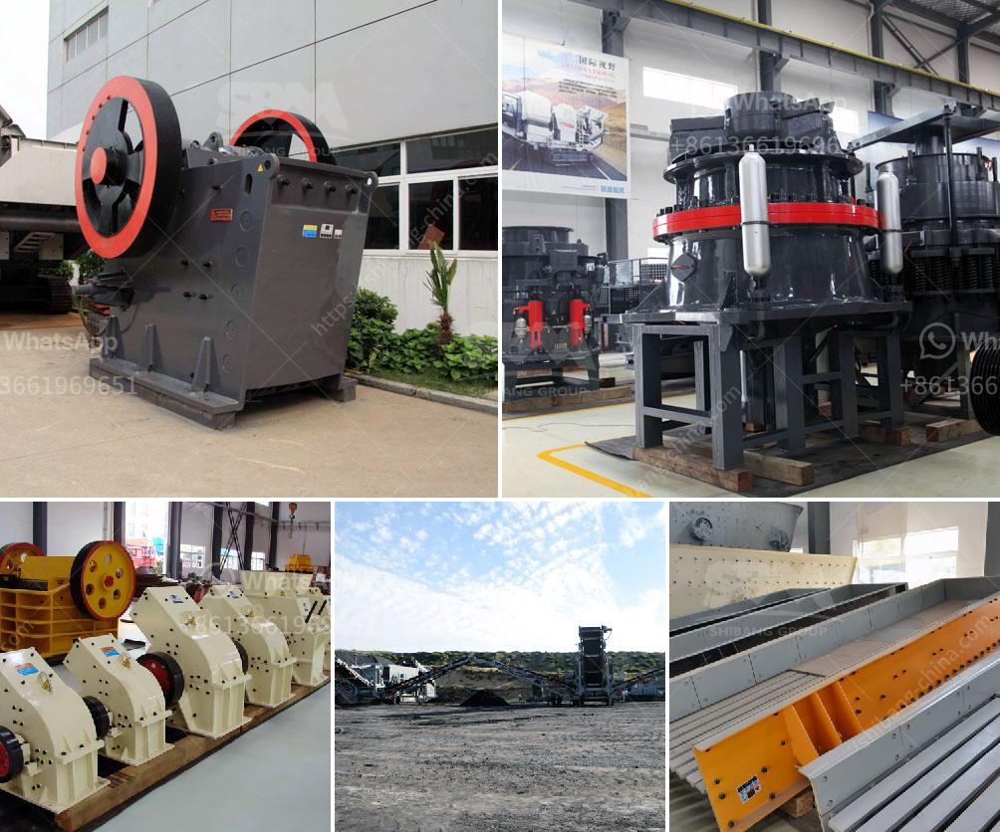

<h3>quarry crusher machine</h3>
Quarries are a vital part of the construction and mining industries. In fact, these massive holes in the ground are responsible for producing most of the materials we use in everyday life, such as gravel, sand, and crushed stone. However, extracting these raw materials from the ground is not an easy task. That is where the quarry crusher machine comes into play.

A quarry crusher is a heavy-duty machine that is specifically designed to break down large rocks into smaller pieces or pebbles. This machine can crush and grind the rocks or stones to produce aggregates for various purposes such as road construction, concrete production, or landfilling.

The quarry crusher machine is equipped with a powerful engine that allows it to run at high speeds. It also features a robust crusher design, adjustable eccentric throw, and a constant intake opening. This machine's unique combination of crushing force and versatility makes it perfect for handling the toughest rock and ore.

One of the main advantages of using a quarry crusher machine is that it produces consistent and high-quality end products. These machines are designed to create uniform-sized aggregates, which are essential for the construction industry. Additionally, the machine's advanced hydraulic system ensures that the crushing process is smooth and efficient, reducing downtime and improving productivity.

Not only does the quarry crusher machine facilitate the production of aggregates, but it also helps to reduce waste. By crushing and reusing materials on-site, quarry owners can minimize transportation costs and reduce the need for additional resources. This is not only beneficial to the environment but also financially advantageous for the quarrying companies.

In conclusion, the quarry crusher machine plays a crucial role in the construction and mining industries. It allows for the efficient production of high-quality aggregates, which are necessary for various construction projects. Additionally, this machine aids in reducing waste and promoting environmentally-friendly practices. Whether it is used in a large-scale quarry or a smaller site, the quarry crusher machine is an essential tool for any quarrying operation.
<h3>Contact us</h3><ul><li><strong>Whatsapp:&nbsp;<a href="https://wa.me/8613661969651">+8613661969651</a></strong></li><li><a href="https://swt.shibang-china.com/?git&amp;zhl&amp;quarry crusher machine"><strong>Online Service(chat now)</strong></a></li></ul><h3>Related</h3><ul><li><a href='impact crusher seller.md'>impact crusher seller</a></li><li><a href='fly ash introduction in cement ball mill.md'>fly ash introduction in cement ball mill</a></li><li><a href='how much complete cost for iron ore crasher plants setup.md'>how much complete cost for iron ore crasher plants setup</a></li><li><a href='ball mill 800 ton day.md'>ball mill 800 ton day</a></li><li><a href='kaolin powder machine.md'>kaolin powder machine</a></li></ul>