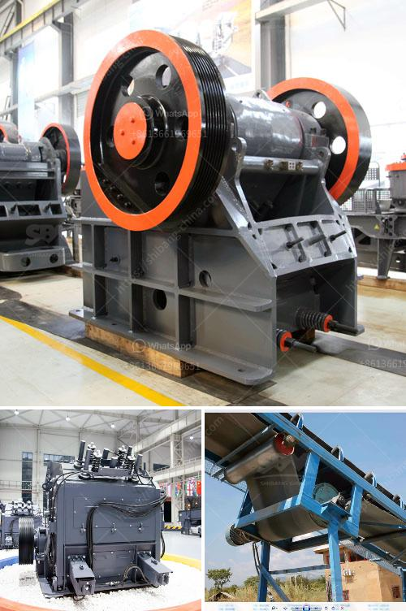

<h3>quarry equipment for sale brisbane</h3>
Quarries play a crucial role in many industries, serving as a source of raw materials for construction projects, roadways, and manufacturing processes. To extract these valuable resources efficiently, quarry operators rely on equipment specifically designed for mining and quarrying tasks. If you are in the market for quarry equipment in Brisbane, you're in luck, as the region offers a variety of options to suit different needs and budgets. Let's dive into the details and explore the possibilities for finding the best deals on quarry equipment for sale in Brisbane.

Brisbane, the capital city of Queensland, boasts a robust quarrying industry due to its rich geological resources. In this flourishing market, equipment suppliers offer an extensive range of machinery tailored for quarrying operations. When it comes to purchasing quarry equipment, it is crucial to consider several key factors, including equipment type, pricing, condition, and after-sales support.

There are various types of quarry equipment available for sale in Brisbane, ranging from earthmoving machinery to crushing and screening equipment. Earthmoving machinery, including excavators, loaders, and bulldozers, are essential for removing overburden and extracting the minerals from the quarry site. It is crucial to assess the specific requirements of your quarry project to determine the appropriate size and capacity of the machinery you need.

Once the minerals are extracted, crushing and screening equipment comes into play. Crushers, screens, and conveyors are used to process and separate the aggregates into different sizes, ensuring that they meet the desired specifications. When considering quarry equipment for sale in Brisbane, it is vital to evaluate the quality and efficiency of the crushing and screening machinery to maximize productivity and minimize downtime.

Pricing is always a significant factor when investing in quarry equipment. It is advisable to compare prices from multiple suppliers to ensure you are getting the best value for your money. However, it's essential to remember that price should not be the sole determining factor. Quality and reliability must also be taken into account to avoid costly repairs and replacements in the future. Look for reputable suppliers that offer competitive prices without compromising on the quality of their equipment.

Inspecting the condition of the quarry equipment before purchasing is highly recommended. Buying used equipment can be a cost-effective option, but it is crucial to thoroughly assess its condition to avoid any unexpected maintenance issues. Engage with knowledgeable professionals who can assist you in inspecting the equipment and ensure it is in good working order.

Lastly, consider the after-sales support provided by the supplier. Quarry equipment is subject to wear and tear due to the demanding nature of the industry. Reliable suppliers should offer warranties, spare parts, and prompt servicing to keep your equipment running smoothly. This reduces the chances of significant downtime and ensures that your quarry operations remain efficient and profitable.

In conclusion, finding the best deals on quarry equipment for sale in Brisbane requires careful consideration of various factors. Choose the equipment type that aligns with your specific needs, compare pricing from different suppliers, inspect the equipment's condition, and ensure reliable after-sales support. By following these steps, you can make an informed decision and acquire the quarry equipment that enhances your operations for years to come.
<h3>Contact us</h3><ul><li><strong>Whatsapp:&nbsp;<a href="https://wa.me/8613661969651">+8613661969651</a></strong></li><li><a href="https://swt.shibang-china.com/?git&amp;zhl&amp;quarry equipment for sale brisbane"><strong>Online Service(chat now)</strong></a></li></ul><h3>Related</h3><ul><li><a href='chrome concentrate wash plant for sale.md'>chrome concentrate wash plant for sale</a></li><li><a href='lime production process.md'>lime production process</a></li><li><a href='limestone mines in ethiopia.md'>limestone mines in ethiopia</a></li><li><a href='copper crusher cost.md'>copper crusher cost</a></li><li><a href='stone quarries in mpumalanga.md'>stone quarries in mpumalanga</a></li></ul>